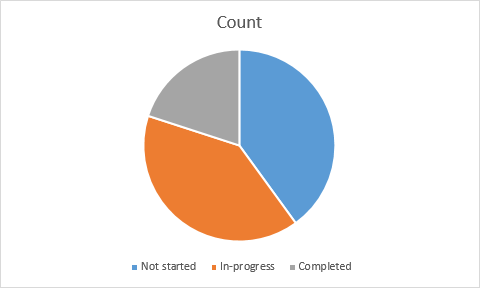
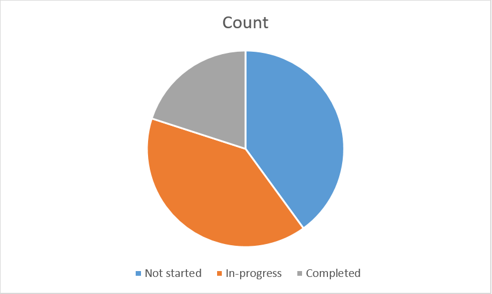

# Chart: Image

> **Important:** APIs under the /beta version in Microsoft Graph are in preview and are subject to change. Use of these APIs in production applications is not supported.

Renders the chart as a base64-encoded image by scaling the chart to fit the specified dimensions.
## Permissions
One of the following permissions is required to call this API. To learn more, including how to choose permissions, see [Permissions](../../../concepts/permissions_reference.md).

|Permission type      | Permissions (from least to most privileged)              |
|:--------------------|:---------------------------------------------------------|
|Delegated (work or school account) | Files.ReadWrite    |
|Delegated (personal Microsoft account) | Files.ReadWrite    |
|Application | Not supported. |

## HTTP request
<!-- { "blockType": "ignored" } -->
```http
GET /workbook/worksheets/{id|name}/charts(<name>)/Image(width=0,height=0,fittingMode='fit')

```
## Request headers
| Name       | Description|
|:---------------|:----------|
| Authorization  | Bearer {token}. Required. |

## Request body
In the request body, provide a JSON object with the following parameters.

| Parameter	   | Type	|Description|
|:---------------|:--------|:----------|
|height|number|Optional. The desired height of the resulting image.|
|width|number|Optional. The desired width of the resulting image.|
|fittingMode|string|Optional. The method used to scale the chart to the specified to the specified dimensions (if both height and width are set)."  Possible values are: `Fit`, `FitAndCenter`, `Fill`.|

## Response

If successful, this method returns `200 OK` response code and base-64 image string in the response body.

## Example
Here is an example of how to call this API.
##### Request
Here is an example of the request.
<!-- { "blockType": "ignored" } -->
```http
GET https://graph.microsoft.com/beta/me/drive/items/{id}/workbook/worksheets/{id|name}/charts(<name>)/Image(width=0,height=0,fittingMode='fit')
```

##### Response
Here is an example of the response. Note: The response object shown here may be truncated for brevity. All of the properties will be returned from an actual call.
<!-- { "blockType": "ignored" } -->
```http
HTTP/1.1 200 OK
Content-type: application/json
Content-length: 3

{
"value" : "base-64 chart image string"
}
```

##### Usage

You can display the base-64 string inside an HTML image tag: ``.

For default behavior, use `Image(width=0,height=0,fittingMode='fit')`. Here is an example of a chart image returned with the default parameters.



If you want to customize the display of the image, specify a height, width, and a fitting mode. Here is what the same chart image looks like if you retrieve it with these parameters: `Image(width=500,height=500,fittingMode='Fill')`.



<!-- uuid: 8fcb5dbc-d5aa-4681-8e31-b001d5168d79
2015-10-25 14:57:30 UTC -->
<!-- {
  "type": "#page.annotation",
  "description": "Chart: Image",
  "keywords": "",
  "section": "documentation",
  "tocPath": ""
}-->
