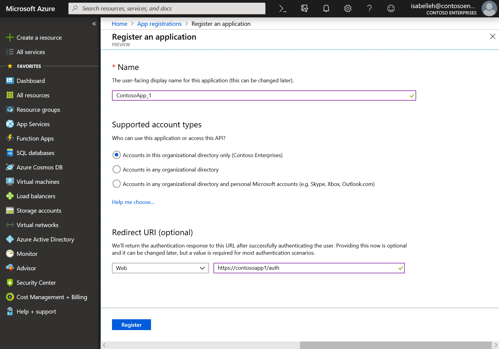
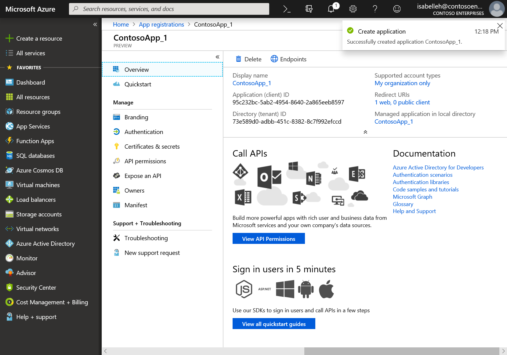

# Register an application with the Microsoft identity platform

This page shows you how to add and register an application using the **App registrations** experience in the Azure portal so that your app can be integrated with the Microsoft identity platform and call Microsoft Graph. 

> [!VIDEO https://www.youtube-nocookie.com/embed/93j0MmRruFo]

## Register a new application using the Azure portal

1. Sign in to the [Azure portal](https://portal.azure.com) using either a work or school account or a personal Microsoft account.
1. If your account gives you access to more than one tenant, select your account in the top right corner, and set your portal session to the Azure AD tenant that you want.
1. In the left-hand navigation pane, select the **Azure Active Directory** service, and then select **App registrations > New registration**.
1. When the **Register an application** page appears, enter your application's registration information:

   - **Name** - Enter a meaningful application name that will be displayed to users of the app.
   - **Supported account types** - Select which accounts you would like your application to support.

       | Supported account types | Description |
       |-------------------------|-------------|
       | **Accounts in this organizational directory only** | Select this option if you're building a line-of-business (LOB) application. This option is not available if you're not registering the application in a directory.  This option maps to Azure AD only single-tenant.  This is the default option unless you're registering the app outside of a directory. In cases where the app is registered outside of a directory, the default is Azure AD multi-tenant and personal Microsoft accounts. |
       | **Accounts in any organizational directory** | Select this option if you would like to target all business and educational customers.  This option maps to an Azure AD only multi-tenant.  If you registered the app as Azure AD only single-tenant, you can update it to be Azure AD multi-tenant and back to single-tenant through the **Authentication** blade. |
       | **Accounts in any organizational directory and personal Microsoft accounts** | Select this option to target the widest set of customers.  This option maps to Azure AD multi-tenant and personal Microsoft accounts.  If you registered the app as Azure AD multi-tenant and personal Microsoft accounts, you cannot change this in the UI. Instead, you must use the application manifest editor to change the supported account types. |

   - **Redirect URI (optional)** - Select the type of app you're building, **Web** or **Public client (mobile & desktop)**, and then enter the redirect URI (or reply URL) for your application.
       - For web applications, provide the base URL of your app. For example, `http://localhost:31544` might be the URL for a web app running on your local machine. Users would use this URL to sign in to a web client application.
       - For public client applications, provide the URI used by Azure AD to return token responses. Enter a value specific to your application, such as `myapp://auth`.

     To see specific examples for web applications or native applications, check out our [quickstarts](https://docs.microsoft.com/azure/active-directory/develop/#quickstarts).

1. When finished, select **Register**.

    

Azure AD assigns a unique application (client) ID to your app, and you're taken to your application's **Overview** page. To add additional capabilities to your application, you can select other configuration options including branding, certificates and secrets, API permissions, and more.

## Platform-specific properties

The following table shows the properties that you need to configure and copy for different kinds of apps. _Assigned_ means that you should use the value assigned by Azure AD.

| App type | Platform | Application (client) ID | Client Secret | Redirect URI/URL | Implicit Flow 
| --- | --- | --- | --- | --- | --- |
| Native/Mobile | Native | Assigned  | No | Assigned | No |
| Web App | Web | Assigned | Yes | Yes | Optional  Open ID Connect middleware uses hybrid flow by default (Yes) | 
| Single Page App (SPA) | Web | Assigned | Yes | Yes | Yes   SPAs use Open ID Connect implicit Flow |
| Service/Daemon | Web | Assigned | Yes | Yes | No |

## Next steps

- Learn more about [permissions and consent](https://docs.microsoft.com/azure/active-directory/develop/v2-permissions-and-consent.md) or view the Microsoft Graph [permissions reference](permissions-reference.md).
- To enable additional configuration features in your application registration, such as credentials and permissions, and enable sign-in for users from other tenants, see these quickstarts:
    - [Configure a client application to access web APIs](https://docs.microsoft.com/azure/active-directory/develop/quickstart-configure-app-access-web-apis.md)
    - [Configure an application to expose web APIs](https://docs.microsoft.com/azure/active-directory/develop/quickstart-configure-app-expose-web-apis.md)
    - [Modify the accounts supported by an application](https://docs.microsoft.com/azure/active-directory/develop/quickstart-modify-supported-accounts.md)
- Choose a [quickstart](https://docs.microsoft.com/azure/active-directory/develop/#quickstarts) to quickly build an app and add functionality like getting tokens, refreshing tokens, signing in a user, displaying some user info, and more.
- Learn more about the two Azure AD objects that represent a registered application and the relationship between them: [Application objects and service principal objects](https://docs.microsoft.com/azure/active-directory/develop/app-objects-and-service-principals.md).
- Learn more about the branding guidelines you should use when developing apps with [Branding guidelines for applications](https://docs.microsoft.com/azure/active-directory/develop/howto-add-branding-in-azure-ad-apps.md).