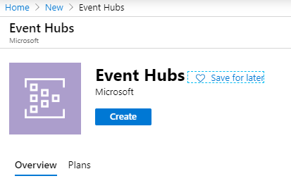
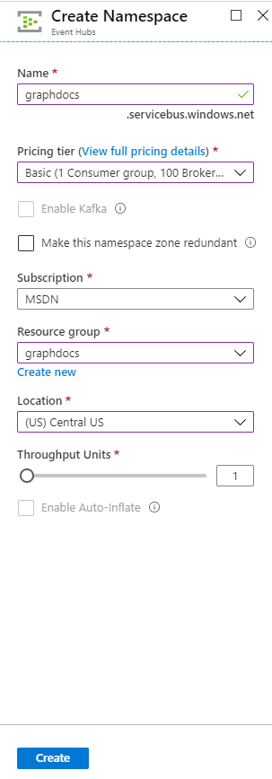
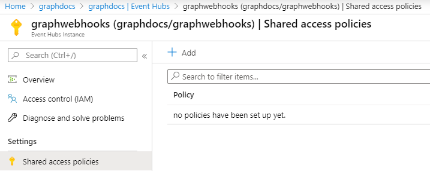
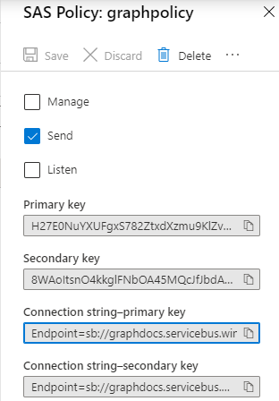
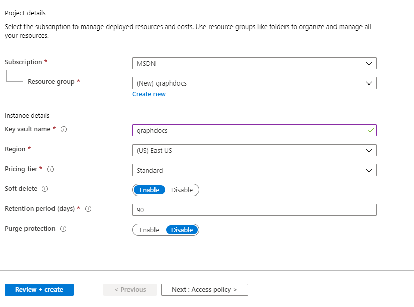
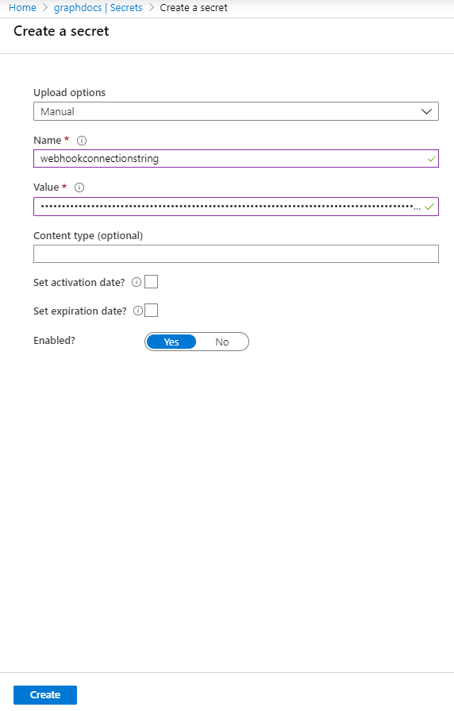
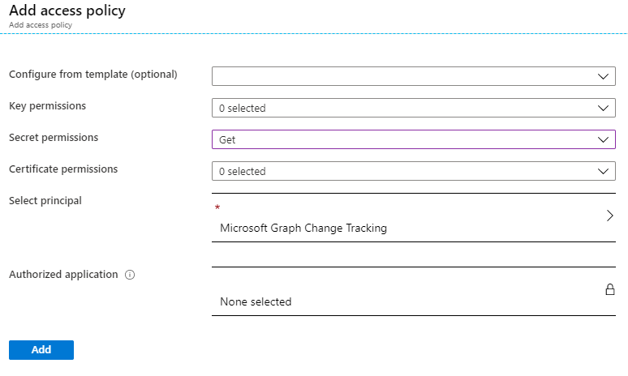

# Get change notifications delivered in different ways (preview)

Change notifications can be delivered in different ways to subscribers. If the main delivery mode for change notifications is through webhooks, it can be challenging to take advantage of webhooks for high throughput scenarios or when the receiver cannot expose a publicly available notificiation URL.  

Good examples of high throughput scenarios include applications subscribing to a large set of resources, applications subscribing to resources that change with a high frequency, and multi-tenant applications that subscribe to resources accross a large set of organizations.

## Using Azure Event Hubs to receive change notifications

[Azure Event Hubs](https://azure.microsoft.com/services/event-hubs) is a popular real-time events ingestion and distribution service built for scale. You can use Azure Events Hubs instead of traditional webhooks to receive change notifications. This feature is currently in preview.  
Using Azure Event Hubs to receive change notifications differs from webhooks in a few ways, including:

- You don't rely on publicly exposed notification URLs. The Event Hubs SDK will relay the notifications to your application.
- You don't need to implement the [notification URL validation](webhooks.md#notification-endpoint-validation).
- You'll need to provision an Azure Event Hub.
- You'll need to provision an Azure Key Vault.

### Set up the Azure KeyVault and Azure Event Hubs

This section will walk you through the setup of required Azure services.

#### Option 1: Using the Azure CLI

The [Azure CLI](/cli/azure/what-is-azure-cli?view=azure-cli-latest) allows you to script and automate adminstrative tasks in Azure. The CLI can be [installed on your local computer](/cli/azure/install-azure-cli?view=azure-cli-latest) or run directly from the [Azure Cloud Shell](/azure/cloud-shell/quickstart).

```shell
# --------------
# TODO: update the following values
#sets the name of the resource group
resourcegroup=rg-graphevents-dev
#sets the location of the resources
location='uk south'
#sets the name of the Azure Event Hubs namespace
evhamespacename=evh-graphevents-dev
#sets the name of the hub under the namespace
evhhubname=graphevents
#sets the name of the access policy to the hub
evhpolicyname=grapheventspolicy
#sets the name of the Azure KeyVault
keyvaultname=kv-graphevents
#sets the name of the secret in Azure KeyVault that will contain the connection string to the hub
keyvaultsecretname=grapheventsconnectionstring
# --------------
az group create --location $location --name $resourcegroup
az eventhubs namespace create --name $evhamespacename --resource-group $resourcegroup --sku Basic --location $location
az eventhubs eventhub create --name $evhhubname --namespace-name $evhamespacename --resource-group $resourcegroup --partition-count 2 --message-retention 1
az eventhubs eventhub authorization-rule create --name $evhpolicyname --eventhub-name $evhhubname --namespace-name $evhamespacename --resource-group $resourcegroup --rights Send
evhprimaryconnectionstring=`az eventhubs eventhub authorization-rule keys list --name $evhpolicyname --eventhub-name $evhhubname --namespace-name $evhamespacename --resource-group $resourcegroup --query "primaryConnectionString" --output tsv`
az keyvault create --name $keyvaultname --resource-group $resourcegroup --location $location --enable-soft-delete true --sku standard --retention-days 90
az keyvault secret set --name $keyvaultsecretname --value $evhprimaryconnectionstring --vault-name $keyvaultname --output none
graphspn=`az ad sp list --display-name 'Microsoft Graph Change Tracking' --query "[].appId" --output tsv`
az keyvault set-policy --name $keyvaultname --resource-group $resourcegroup --secret-permissions get --spn $graphspn --output none
keyvaulturi=`az keyvault show --name $keyvaultname --resource-group $resourcegroup --query "properties.vaultUri" --output tsv`
domainname=`az ad signed-in-user show --query 'userPrincipalName' | cut -d '@' -f 2 | sed 's/\"//'`
notificationUrl="EventHub:${keyvaulturi}secrets/${keyvaultsecretname}?tenantId=${domainname}"
echo "Notification Url:\n${notificationUrl}"
```

> **Note:** The script provided here is compatible with Linux based shells, Windows WSL, and Azure Cloud Shell. It will require some updates to run in Windows shells.

#### Option 2: Using the Azure Portal

##### Configuring the Azure Event Hub

In this section you will:

- Create an Azure Event Hub namespace.
- Add a hub to that namespace that will relay and deliver notifications.
- Add a shared access policy that will allow you to get a connection string to the newly created hub.

Steps:

1. Open a browser to the [Azure Portal](https://portal.azure.com).
1. Select **Create a resource**.
1. Type **Event Hubs** in the search bar.
1. Select the **Event Hubs** suggestion. The Event Hubs creation page will load.  
    
1. On the Event Hubs creation page, click **Create**.
1. Fill in the Event Hubs namespace creation details, and then click **Create**.  
    
1. When the Event Hub namespace is provisioned, go to the page for the namespace.  
    
1. Click **Event Hubs** and **+ Event Hub**.  
    
1. Give a name to the new Event Hub, and click **Create**.  
    
1. After the Event Hub has been created, click the name of the Event Hub, and then click **Shared access policies** and **+ Add** to add a new policy.  
    
1. Give a name to the policy, check **Send**, and click **Create**.  
    
1. After the policy has been created, click the name of the policy to open the details panel, and then copy the **Connection string-primary key** value. Write it down; you'll need it for the next step.  
    

##### Configuring the Azure Key Vault

In order to access the Event Hub securely and to allow for key rotations, Microsoft Graph gets the connection string to the Event Hub through Azure Key Vault.  
In this section, you will:

- Create an Azure Key Vault to store secret.
- Add the connection string to the Event Hub as a secret.
- Add an access policy for Microsoft Graph to access the secret.

Steps:

1. Open a browser to the [Azure Portal](https://portal.azure.com).
1. Select **Create a resource**.
1. Type **Key Vault** in the search bar.
1. Select the **Key Vault** suggestion. The Key Vault creation page will load.
1. On the Key Vault creation page, click **Create**.  
    
1. Fill in the Key Vault creation details, and then click **Review + Create** and **Create**.  
    
1. Go to the newly crated key vault using the **Go to resource** from the notification.  
    
1. Copy the **DNS name**; you will need it for the next step.  
    
1. Go to **Secrets** and click **+ Generate/Import**.  
    
1. Give a name to the secret, and keep the name for later; you will need it for the next step. For the value, paste in the connection string you generated at the Event Hubs step. Click **Create**.  
    
1. Click **Access Policies** and **+ Add Access Policy**.  
    
1. For **Secret permissions**, select **Get**, and for **Select Principal**, select **Microsoft Graph Change Tracking**. Click **Add**.  
    

### Creating the subscription and receiving notifications

After you create the required Azure KeyVault and Azure Event Hubs services, you will be able to create your subscription and start receiving change notifications via Azure Event Hubs.

#### Creating the subcription

Subscriptions to change notifications with Event Hubs are almost identical to change notifications with webhooks. The key difference is that they rely on Event Hubs to deliver notifications. All other operations are similar, including [subscription creation](/graph/api/subscription-post-subscriptions?view=graph-rest-beta).  

The main difference during subscription creation will be the **notificationUrl**. You must set it to `EventHub:https://<azurekeyvaultname>.vault.azure.net/secrets/<secretname>?tenantId=<domainname>`, with the following values:

- `azurekeyvaultname` - The name you gave to the key vault when you created it. Can be found in the DNS name.
- `secretname` - The name you gave to the secret when you created it. Can be found on the Azure Key Vault **Secrets** page.
- `domainname` - The name of your tenant; for example, consto.onmicrosoft.com or contoso.com. Because this domain will be used to access the Azure Key Vault, it is important that it matches the domain used by the Azure subscription that holds the Azure Key Vault. To get this information, you can go to the overview page of the Azure Key Vault you created and click the subscription. The domain name is displayed under the **Directory** field.

#### Receiving notifications

Events will be now delivered to your application by Event Hubs. For details, see [receiving events](https://docs.microsoft.com/azure/event-hubs/get-started-dotnet-standard-send-v2#receive-events) in the Event Hubs documentation.

Before you can receive the notifications in your application, you'll need to create another shared access policy with a "Listen" permission and obtain the connection string, similar to the steps listed in [Configuring the Azure Event Hub](#configuring-the-azure-event-hub).

> **Note:** Create a separate policy for the application that listens to Event Hubs messages instead of reusing the same connection string you set in Azure KeyVault. This ensures that each component of the solution has only the permissions it needs and follows the least permissions security principle.

### What happens if the Microsoft Graph change tracking application is missing?

It's possible that the **Microsoft Graph Change Tracking** service principal is missing from your tenant, depending on when the tenant was created and administrative operations. To resolve this issue, run [the following query](https://developer.microsoft.com/en-us/graph/graph-explorer?request=servicePrincipals&method=POST&version=v1.0&GraphUrl=https://graph.microsoft.com&requestBody=eyJhcHBJZCI6IjBiZjMwZjNiLTRhNTItNDhkZi05YTgyLTIzNDkxMGM0YTA4NiJ9) in [Microsoft Graph Explorer](https://developer.microsoft.com/en-us/graph/graph-explorer).

Query details:

```http
POST https://graph.microsoft.com/v1.0/servicePrincipals
{
    "appId": "0bf30f3b-4a52-48df-9a82-234910c4a086"
}
```

> **Note:** You can get an access denied running this query. In this case, select the gear icon next to your account name in the top left corner. Then select **Select Permissions** and search for **Application.ReadWrite.All**. Check the permission and select **Consent**. After consenting to this new permission, run the request again.

> **Note:** This API only works with a school or work account, not with a personal account. Make sure that you are signed in with an account on your domain.

Alternatively, you can use this [Azure Active Directory PowerShell](https://docs.microsoft.com/powershell/azure/active-directory/install-adv2?view=azureadps-2.0) script to add the missing service principal.

```PowerShell
Connect-AzureAD -TenantId <tenant-id>
# replace tenant-id by the id of your tenant.
New-AzureADServicePrincipal -AppId 0bf30f3b-4a52-48df-9a82-234910c4a086
```

## Next steps

See the following Azure Event Hubs quick starts:

- [.NET Core](/azure/event-hubs/get-started-dotnet-standard-send-v2)
- [Java](/azure/event-hubs/event-hubs-java-get-started-send)
- [Python](/azure/event-hubs/get-started-python-send-v2)
- [JavaScript](/azure/event-hubs/get-started-node-send-v2)