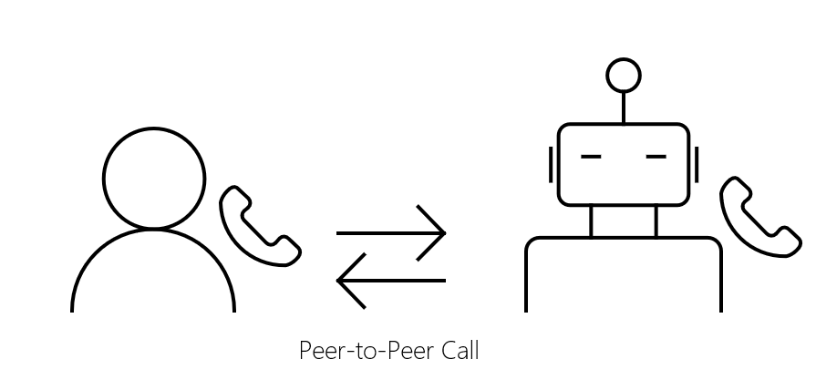

# Understand calls

Learn about the supported call types and how they're used for the signaling process.

## Peer-to-Peer calls
A call is Peer-to-Peer (p2p) when one participant is directly calling another participant. If a bot calls a user, and the user is the only calling target specified, this is an example of a p2p call.

### Permissions
If a user wants to call a bot, the bot doesn't need any additional permissions in order to respond to the p2p call.

In order for a bot to call a user, it must have the *Calls.Initiate.All* permission for a p2p call.

## Group calls

A group call occurs if there are either 3 participants (at least) in the call, or if there are [meeting coordinates](/graph/api/resources/onlinemeeting) that are specified when the call was initially created. 

You can create a group call through Microsoft Teams, for example.

  

Currently, bots are able to
- create group calls on their own
- join exisiting group calls
- invite other participants into an existing group call
- be invited into existing group calls

### Permissions:
Please view the [permissions for calls](/graph/permissions-reference#calls-permissions) for more information.
