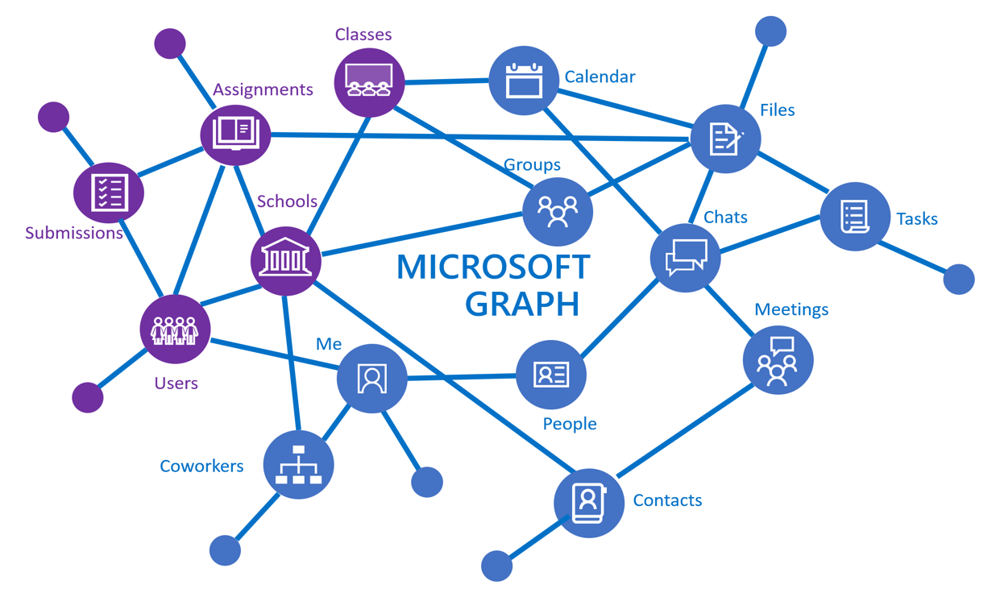
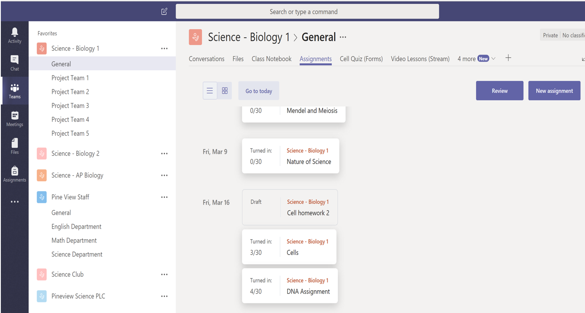

# Microsoft Graph education API overview

# Microsoft EDU Graph Overview

The education APIs in Microsoft Graph enhance Office 365 resources with information that is relevant for education scenarios including information about schools, classes, users(students and teachers), assignments and submissions. This makes it easy for application developers to build solutions that integrate with educational resources for various school and classroom scenarios.

Here is an overview of EDU Endpoints in Microsoft Graph

# Why integrate with EDU Graph?

## Build applications that are aware of class Roster

Most education software developers learn early on that class Roster is one of the key pieces of information that they need to run their application and its typically locked away inside a school Student Information System (SIS).  Anytime teachers bring a new application into their classroom they spend time manually importing Roster data into the app. Many ISVs address this by connecting with various SIS to import Roster data but with hundreds of Student Information Systems with proprietary formats this can easily become challenging. [Microsoft School Data Sync](https://sds.microsoft.com/) combined with Roster APIs addresses this challenge for application developers and schools.

Here are examples of a few scenarios enabled by rostering APIs :

- [Get all classes in a school](https://developer.microsoft.com/en-us/graph/docs/api-reference/v1.0/api/educationschool_list_classes)
- [Get all users in a class](https://developer.microsoft.com/en-us/graph/docs/api-reference/v1.0/api/educationclass_list_members)
- [Get all the classes I teach](https://developer.microsoft.com/en-us/graph/docs/api-reference/v1.0/api/educationuser_list_classes)

##  Enable your teachers to create assignments at the click of a buttion using Assignments APIs (preview)
Microsoft Teams in EDU is a digital hub that brings conversations, content, and apps together in one place for classrooms. Teams provides a [rich set of extensbility points](https://docs.microsoft.com/en-us/microsoftteams/platform/concepts/apps/apps-overview) for application developers including creating Tabs, Connectors, Bots. The Graph API also includes an extension surface area that allows for Rest API Integration into Teams.  It provides the ability for an application to work with assignments and submissions within Teams. 

With Assigment APIs your app can interact with the assignment service outside of Teams. Teams will handle distribution, due dates and grading while your system can provide a rich learning experience to students.
Here are examples of a few scenarios enabled by Assignments API:

- [Add an Assignment that links to your application](https://developer.microsoft.com/en-us/graph/docs/api-reference/beta/api/educationclass_post_assignments) . 
- [Assign grades to individual students for assignments linked to your application](https://developer.microsoft.com/en-us/graph/docs/api-reference/beta/api/educationsubmission_update).
- [Create a student dashboard to show which assigments are due by when](https://developer.microsoft.com/en-us/graph/docs/api-reference/beta/api/educationclass_list_assignments).

## Enable school ITs to manage Idenity and Roster sync using School Data Sync Management (preview)

[School Data Sync](https://sds.microsoft.com/) helps to automate the process of importing and synchronizing student identity and roster data from student information systems with Azure Active Directory (Azure AD) and Office 365. Once the information is synchronized, app developers can use the Roster APIs to read the Roster information into the applications . If you are an system integrator setting up integration of a School's Student Information System with School Data Sync, you can use the SDS management APIs in Microsoft Graph to set up synchronization from either a CSV file or a supported SIS API connector.

School Data Sync Management APIs support end to end scenarios for managing sync. Here are a few examples:

- [Create a synchronization profile that automatically starts a sync](https://developer.microsoft.com/en-us/graph/docs/api-reference/beta/api/educationsynchronizationprofile_post)
- Manage sync lifecycle with [Pause](https://developer.microsoft.com/en-us/graph/docs/api-reference/beta/api/educationsynchronizationprofile_pause), [Resume](https://developer.microsoft.com/en-us/graph/docs/api-reference/beta/api/educationsynchronizationprofile_resume) and [Reset](https://developer.microsoft.com/en-us/graph/docs/api-reference/beta/api/educationsynchronizationprofile_reset) operations.

## Next Steps:

### 1. Learn more about the reference APIs:

- Learn more about Roster APIs : [Roster APIs](https://developer.microsoft.com/en-us/graph/docs/api-reference/v1.0/resources/education-overview)

- Learn more about Assignments APIs (preview) : [Assignment APIs](https://developer.microsoft.com/en-us/graph/docs/api-reference/beta/resources/educationassignment)

- Learn more about School Data Sync Management APIs (preview) : [SDS Management APIs](https://developer.microsoft.com/en-us/graph/docs/api-reference/beta/resources/educationsynchronizationprofile)

### 2. Try out the APIs in Graph Explorer:

- Try out the EDU Graph APIs in Graph Explorer : [Graph Explorer](https://developer.microsoft.com/en-us/graph/graph-explorer)

### 3. Get started using the samples:

Check out end to end sample for Single Sign On, Roster Data integration and Assignments Integration using the samples below:

- [.NET Sample for SSO & Rostering](https://github.com/OfficeDev/O365-EDU-AspNetMVC-Samples
    )

- [Angular Node Sample for SSO & Rostering](https://github.com/OfficeDev/O365-EDU-AngularNodeJS-Samples)
    
- [Python Sample for SSO & Rostering](https://github.com/OfficeDev/O365-EDU-Python-Samples)

- [PHP Sample for for SSO & Rostering](https://github.com/OfficeDev/O365-EDU-PHP-Samples)

- [Sample for profile management APIs](https://github.com/OfficeDev/O365-EDU-SDS-AspNetMVC-Samples) 

 

