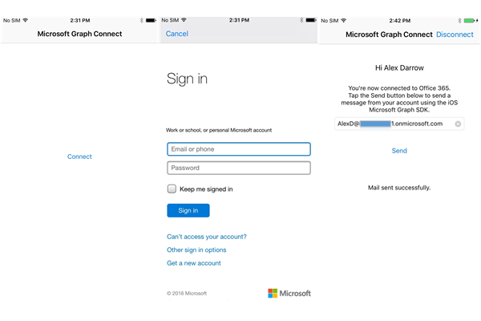

# iOS samples for the Microsoft Graph API
This article introduces two iOS samples that authenticate a user against Office 365 or Managed Service Accounts (MSA) such as consumer Outlook users. Both samples send an email through the Outlook service but one of the samples extends the feature by getting the user's profile photo and sending it in the body of the email

## iOS Objective C Connect REST sample
This sample uses a standard iOS HTTPS library to make REST calls to the Microsoft Graph. It uses the Microsoft Authentication Library (MSAL) to authenticate a user. The MSAL library lets your app authenticate a user from Office 365 or from an MSA account. You won't be able to authenticate a user from an on-premise Azure Active Directory instance though.

You can send an email with this sample, but it does not retrieve the authenticated user's photo or embed it in the email.

- [Get started with Microsoft Graph in an Objectve C iOS App](ios_objectivec.md)

## iOS Swift Sonnect sample
This sample uses the Microsoft Graph client library for Objective C to access the Microsoft Graph endpoint. User authentication is handled by the third-party [NXOAuth2Client](https://github.com/nxtbgthng/OAuth2Client) library. This library lets your app authenticate a user from an on premise Azure Active Directory instance but does not authenticate MSA users.

The sample shows you how to access the user's Azure profile through the Graph. You also learn how to get the user's profile photo, upload the photo to the user's OneDrive storage and embed the photo in the body of an Outlook email message.

The following image shows the app you'll create.

