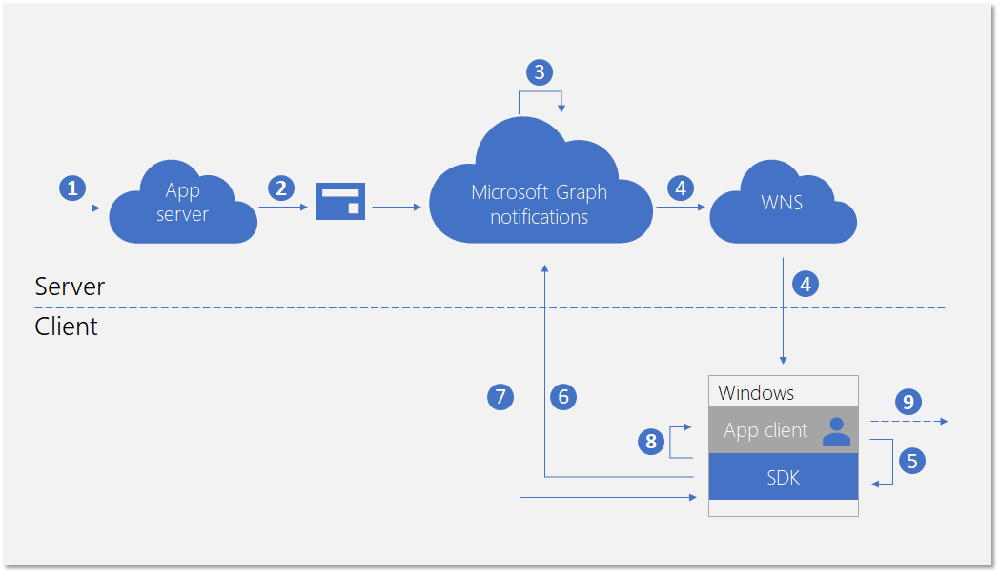
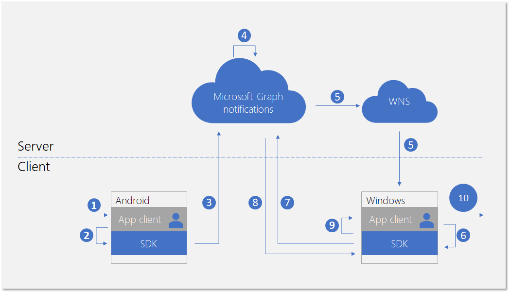
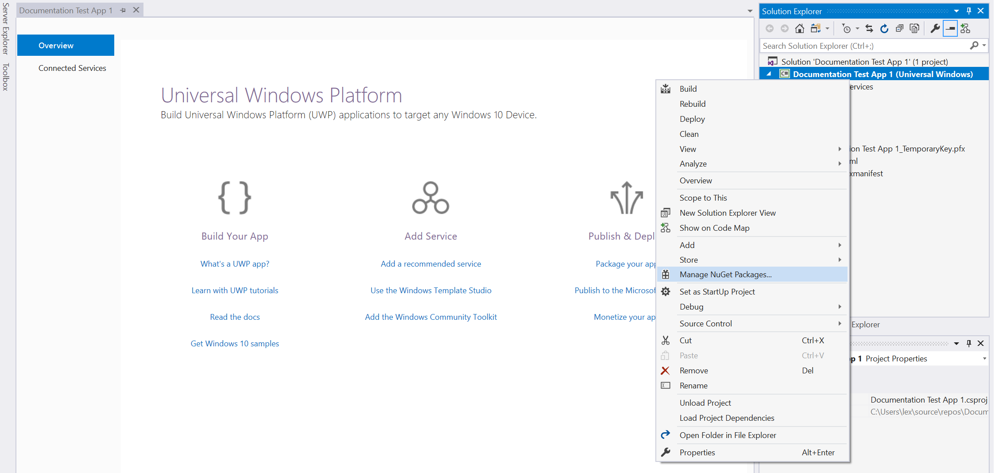
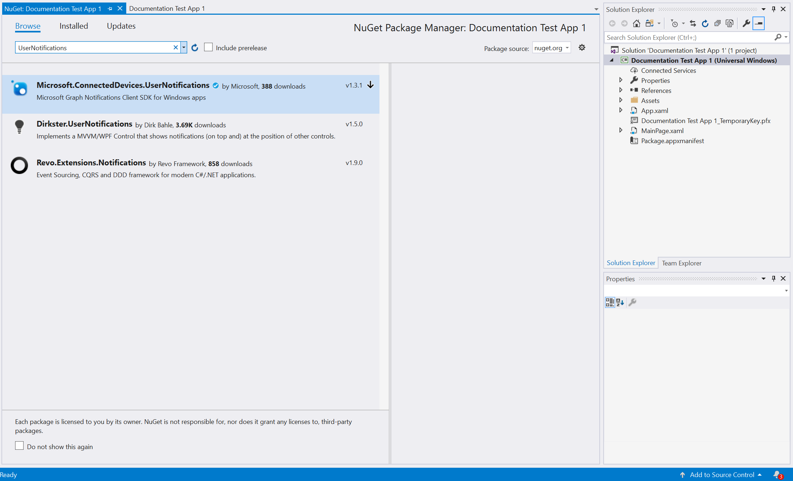
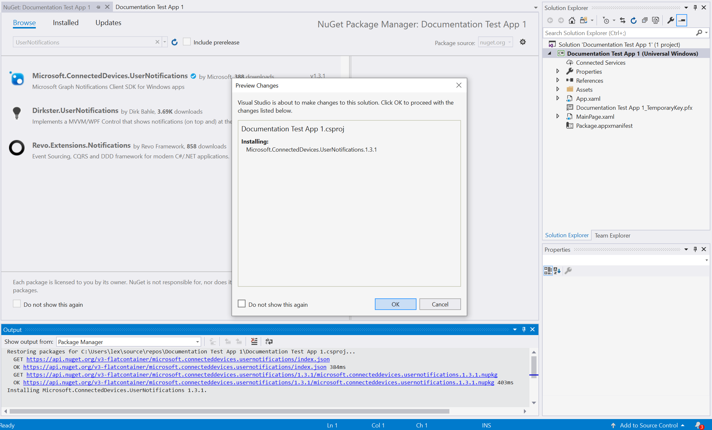

# Integrating your Windows UWP app with the client-side SDK for user notifications

## Summary

Now that you've completed [app registrations](notif-integration-app-registration.md) in the Azure Portal and [Cross-Device Experiences onboarding](notif-integration-cross-device-experiences-onboarding.md) in Microsoft Partner Dev Center, let's move on to code integration. 

This page captures the steps for integrating your client app with the client-side SDK for Windows UWP apps.  

With the client-side SDK, your app can perform the necessary registration steps in order to start receiving notifications published from your app server targeted at the current logged-in user. The SDK is then used to manage the notifications on the client side including receiving new incoming notifications, managing the state of notifications in order to achieve scenarios like "universal dismiss", and retrieving full notification history. 

## New incoming notification flow

For receiving new incoming notifications, here is an illustration of the data flow:



In this diagram, you can see a few components involved in this process:
* App server - this is the backend of your application;
* App client - this is the frontend of your application, being a UWP app, an Android app, or an iOS app;
* Microsoft Graph notifications - this is the service component that enables user notifications to be published, stored, and synced across different instances of app clients across devices and platforms;
* WNS - this is the Windows push notification service that Microsoft Graph notifications leverages to signal the clients.

Here is a break down for the steps highlighted in the diagram: 
* Step 1. (Application logic) This step captures what triggers the notification to be published to the user. This is app-specific logic, it could be an event or data update about something else inside Microsoft Graph, such as a new calendar event or a new task assignment, or basically anything your app service wants to notify the user about.
* Step 2. App server publishes a notification to the targeted user using the notification API on Microsoft Graph. For more details on how to create and publish a notification, see guidance on [server side integration](notif-integrating-app-server.md).
* Step 3. Upon receiving the web request containing the new notification, Microsoft Graph notifications persists the content of the notification securely in the cloud for this app and this user.
* Step 4. For each app client instance subscribing to receive notifications for this user, Microsoft Graph notifications sends a signal to notify the app client, via the native push service provided by the OS/system this application is implemented on. In this case, the application is a UWP app on Windows, and we leverage [WNS push raw notification](https://docs.microsoft.com/en-us/windows/uwp/design/shell/tiles-and-notifications/raw-notification-overview) to send the signal. 
* Step 5. Once the application is woken up by the incoming push notification, it asks the SDK to fetch for the changes in the user notification store. 
* Step 6 and 7. The SDK establishes a secure and compliant connection with the user notifications store in Microsoft Graph and retrieves the data changes - in this case, the changes are the new notification contents. 
* Step 8. The SDK fires event callbacks to notify the app once the changes are successfully retrieved. 
* Step 9. (Application logic) This step captures what your app chooses to do inside the event callback. Usually, this results in local app data changes and local UI updates. In this case, since there are new notification contents, the app usually should construct a toast notification popup to notify the user.

## Notification update flow

One of the main benefits for using Microsoft Graph notifications is that it persists notifications in the cloud securely and turns them into a stateful resource type. Therefore, it can help your application to easily manage and sync the correct state of the notifications across different devices for the same logged in user in a cross-device scenario. When a notification is marked as dismissed, or marked as read on one device, the other devices can be notified in real-time so "handled once, dismissed everywhere" can become a true promise as part of the notification experience for your users. 

For changing the state of a notification or deleting the notification on one device, and receiving/handling the state change or the deletion on another device, here is an illustration of the data flow:



Observe that the second part of the flow is very similar to the flow for handling new incoming notifications. This is by design - the SDK's programming pattern is designed in a way that the application client can handle all types of user notification data changes (such as new incoming notifications, notification state changes, notification deleted, etc.) in a similar way.  

Here is a break down for the steps highlighted in the diagram:

* Step 1 and 2. (Application logic) These steps captures what triggers the notification to be changed or deleted. This is app-specific logic. In general, any event can trigger a notification to change. Currently, we expose 2 properties regarding state changes - UserActionState and ReadState, but your application ultimately gets to decide the definition of these states and when they need to be updated. For example, when a user dismissed the notification popup, you can update the UserActionState to be Dismissed. When a user clicked on the notification popup and launched the app to consume corresponding app content, you can update the UserActionState to be Activated and update the ReadState to be Read. 
* Step 3. Once the corresponding API is called to update or delete a notification, the SDK will call into the user notification store in the cloud in order to fan-out this change to the other app client instances with the same logged in user. 
* Step 4. Upon receiving the update/delete request from a client, Microsoft Graph notifications will update the notification store accordingly, and identify the other app client instances who subscribed to this change.
* Step 5. For each app client subscription, Microsoft Graph notifications sends a signal to notify the app client, via the native push service provided by the OS/system this application is implemented on. In this case, the application receiving the change update is a UWP app on Windows, and we leverage [WNS push raw notification](https://docs.microsoft.com/en-us/windows/uwp/design/shell/tiles-and-notifications/raw-notification-overview) to send the signal. 
* Step 6. Once the application is waken up by the incoming push notification, it asks the SDK to fetch for the changes in the user notification store. 
* Step 7 and 8. The SDK establishes a secure and compliant connection with the user notifications store in Microsoft Graph and retrieves the data changes - in this case, the changes are notification state updates or notification deletions. 
* Step 9. The SDK fires event callbacks to notify the app once the changes are successfully retrieved. 
* Step 10. (Application logic) This step captures what your app chooses to do inside the event callback. Usually, this results in local app data changes and local UI updates. In this case, since there are notification updates, the app usually should update the UI locally to reflect the state change. For example, if a notification is marked as activated, you can remove the corresponding toast notification popup inside Windows action center in order to achieve "handled once, dismissed everywhere". 

For more information about Microsoft Graph notifications and how it enables a human-centric notification experience, see [Microsoft Graph Notifications Overview](notifications-concept-overview.md).
For more information about the steps required to integrate with Microsoft Graph notifications from end to end, see Microsoft Graph notifications [integration overview](notif-integration-e2e-overview.md).

Now let's take a look at a step by step breakdown of what you need to do to integrate with Microsoft Graph notifications SDK in your Windows UWP app. 

## Adding the SDK to your project

On Windows, the client-side SDK is a NuGet package that ships outside of Windows OS. This API is available in C#, C++, and WinJS. 

Download the NuGet package for Microsoft Graph notifications SDK for Windows apps [here](https://www.nuget.org/packages/Microsoft.ConnectedDevices.UserNotifications), or directly download it from your app solution inside Visual Studio with below steps: 

In Visual Studio, right click on the project to bring up the context menu, then click on "Manage NuGet Packages…".



Navigate to "Browse" tab, and search for "Microsoft.ConnectedDevices.UserNotifications".



You will see the Microsoft Graph notifications client-side SDK in the search results. Click on the install button to install it. 



Once installation completes, you should see that this package shows up under References inside the Solution Explorer. 

For more details on including and consuming NuGet packages from your UWP app, please see these links. 
* [Use packages from nuget.org](https://docs.microsoft.com/en-us/azure/devops/artifacts/nuget/upstream-sources?view=vsts&tabs=new-nav)
* [Quickstart: Install and use a package in Visual Studio](https://docs.microsoft.com/en-us/nuget/quickstart/install-and-use-a-package-in-visual-studio)


## Initializing the Connected Device Platforms

The client-side SDK is built on top of an infrastructure called Connected Device Platform. Before any feature can be used, the platform must be initialized within your app. The initialization steps should occur in your main class **OnLaunched** or **onActivated** method, because they are required before the notification scenarios can take place.

You must construct and initialize the platform by instantiating the **ConnectedDevicesPlatform** class. Before doing that, make sure to hook up event handlers because once platform is started the events may begin to fire. 

Sample in C#:

```C#
var platform = new ConnectedDevicesPlatform();
platform.AccountManager.AccessTokenRequested += AccountManager_AccessTokenRequestedAsync;
platform.AccountManager.AccessTokenInvalidated += AccountManager_AccessTokenInvalidated;
platform.NotificationRegistrationManager.NotificationRegistrationStateChanged += NotificationRegistrationManager_NotificationRegistrationStateChanged;
platform.Start();
```

### Handling account access token

All the web calls the SDK makes, including retrieving the content of a new incoming notification, updating notification states, and more, are essentially reading from or writing to the user's data, thus always require a valid access token. The SDK requires you to handle the below events - invoked when an access token is requested or invalidated to make sure that once the platform is successful initialized, your access token for the user is handled correctly. 

#### AccountManager_AccessTokenRequestedAsync

A full implementation can be found in Windows app [sample](https://github.com/Microsoft/project-rome/blob/master/Windows/samples/GraphNotificationsSample/ConnectedDevicesManager.cs). 

```C#
private async void AccountManager_AccessTokenRequestedAsync(ConnectedDevicesAccountManager sender, ConnectedDevicesAccessTokenRequestedEventArgs args)
{
    private List<Account> accounts = new List<Account>();
    var account = accounts.Find((x) => x.EqualsTo(args.Request.Account));
    if (account != null)
    {
        try
        {
            var accessToken = await account.GetAccessTokenAsync(args.Request.Scopes);
            args.Request.CompleteWithAccessToken(accessToken);
        }
        catch (Exception ex)
        {
            args.Request.CompleteWithErrorMessage(ex.Message);
        }
    }
}
```

#### AccountManager_AccessTokenInvalidated

A full implementation can be found in Windows app [sample](https://github.com/Microsoft/project-rome/blob/master/Windows/samples/GraphNotificationsSample/ConnectedDevicesManager.cs). 

```C#
private void AccountManager_AccessTokenInvalidated(ConnectedDevicesAccountManager sender, ConnectedDevicesAccessTokenInvalidatedEventArgs args)
{
    Logger.Instance.LogMessage($"Token Invalidated. AccountId: {args.Account.Id}, AccountType: {args.Account.Id}, scopes: {string.Join(" ", args.Scopes)}");
}
```

### Handling push registration expiration 

Microsoft Graph notifications leverages the native push platform on Windows - WNS, to signal the client application on user notifications data changes. This happens when new incoming notifications are published from your app server, or when any notification's state is updated on a different device with the same logged in user in a cross-device scenario. 

Therefore, a valid WNS channel that allows raw push notifications to come through successfully is required, below event callback handles WNS push channel expirations. 

#### NotificationRegistrationManager_NotificationRegistrationStateChanged

A full implementation can be found in Windows app [sample](https://github.com/Microsoft/project-rome/blob/master/Windows/samples/GraphNotificationsSample/ConnectedDevicesManager.cs). 

```C#
private async void NotificationRegistrationManager_NotificationRegistrationStateChanged(ConnectedDevicesNotificationRegistrationManager sender, ConnectedDevicesNotificationRegistrationStateChangedEventArgs args)
{
    if ((args.State == ConnectedDevicesNotificationRegistrationState.Expired) || (args.State == ConnectedDevicesNotificationRegistrationState.Expiring))
    {
        var account = m_accounts.Find((x) => x.EqualsTo(args.Account));
        if (account != null)
        {
            await account.RegisterAccountWithSdkAsync();
        }
    }
}
```

## Logging in your user

Microsoft Graph notifications, like many other resource types inside Microsoft Graph, are centralized around users. In order for your app to subscribe to and start receiving notifications for the logged in user, you first need to obtain a valid Oauth token to be used in the registration process. You may choose to use your preferred method of generating and managing the Oauth tokens. The sample app used ADAL to achieve this. 

If you're using an MSA, you will need to include the following scopes in your sign-in request: `"wl.offline_access"`, `"ccs.ReadWrite"`, `"wns.connect"`, `"asimovrome.telemetry"`, and `"https://activity.windows.com/UserActivity.ReadWrite.CreatedByApp"`. 

If you're using an AAD account, you'll need to request the following audience: `"https://cdpcs.access.microsoft.com"`.


## Adding the user account to the platform 

You need to register the logged in user account with the SDK, which involves adding the account and registering a push channel in order to receive the initial push notifications through WNS. 

```C#
var account = new ConnectedDevicesAccount(accountId, accountType);           
var addResult = await platform.AccountManager.AddAccountAsync(account);
if (addResult.Status != ConnectedDevicesAccountAddedStatus.Success)
{
    throw new Exception("Add account failed with " + addResult.Status + "!");
}            

var pushChannel = await PushNotificationChannelManager.CreatePushNotificationChannelForApplicationAsync();
ConnectedDevicesNotificationRegistration registration = new ConnectedDevicesNotificationRegistration();
registration.Type = ConnectedDevicesNotificationType.WNS;
registration.Token = pushChannel.Uri;
var registerResult = await platform.NotificationRegistrationManager.RegisterAsync(account, registration);
if (registerResult.Status != ConnectedDevicesNotificationRegistrationStatus.Success)
{
    throw new Exception("Register push channel failed with " + registerResult.Status + "!");
}
```

## Subscribing to receive user's notifications 

You need to instantiate a UserDataFeed object for your application for this logged in user. Your application is identified by the cross-platform app id you provided during the [Cross-Device Experiences onboarding](notif-integration-cross-device-experiences-onboarding.md).

```C#
UserDataFeed feed = UserDataFeed.GetForAccount(account, platform, "YOUR_HOST_HERE");

var scopes = new List<UserDataFeedSyncScope> { UserNotificationChannel.SyncScope };
var subscribeResult = await feed.SubscribeToSyncScopesAsync(scopes);
if (!subscribeResult)
{
    throw new Exception("Subsribe failed!");
}
var channel = new UserNotificationChannel(feed);
var reader = channel.CreateReader();
reader.DataChanged += Reader_DataChanged;
```

## Receiving and managing user notifications

In the flow diagram above we illustrated the programming patterns to handle a new incoming notification from an app server and a notification update or deletion initiated from another app client instance are very similar. Below shows the steps for handling these data changes. 

### Handling incoming push notification signal

All types of user notification data changes generate a signal that gets delivered to the app clients as a push notification. In the case of a Windows UWP app the signal is delivered as a WNS push raw notification. Upon receiving the raw push signal the app should call **TryParse** to trigger the SDK to fetch from the Microsoft Graph notifications service for the actual data changes.

```C#
public async Task ReceiveNotificationAsync(string content)
{
    ConnectedDevicesNotification notification = ConnectedDevicesNotification.TryParse(content);
    if (notification != null)
    {
        await platform.ProcessNotificationAsync(notification);
    }
}
```

### Handling user notification data changes

After the SDK successfully completes fetching the data changes, an event callback is invoked and the app client is expected to handle notification creations/updates/deletions.

```C#
private async void Reader_DataChanged(UserNotificationReader reader, object args)
{
    var notifications = await reader.ReadBatchAsync(UInt32.MaxValue);

    foreach (var notification in notifications)
    {
        // Handle notification changes based on change type;
    }
}
```


### Update state of a notification

If a notification state change is initiated from this app client instance (for example, if the toast notification popup on this device is activated by the user), the app needs to call the SDK to update the notification's state in order to have this state change synced across all devices used by the same user. 

```C#
notification.UserActionState = UserNotificationUserActionState.Activated;
await notification.SaveAsync();
```

### Delete a notifications

If a notification deletion is initiated from this app client instance (for example, if the task corresponding to this notification is marked as complete and is removed from your app's database), the app needs to call the SDK to delete the notification in order to have this delete operation synced across all devices used by the same user. 

A notification is removed from the user notification store only if it is expired or explicitly deleted. A user notification is not deleted when you update the UserActionState to be Dismissed, since the semantic definition of UserActionState is defined by the application itself.

```C#
await channel.DeleteUserNotificationAsync(notification.Id);
```

## See also

### [API reference](https://docs.microsoft.com/en-us/windows/project-rome/notifications/api-reference-for-windows/) for the full set of APIs related to notification features in the SDK. 
### Complete [client-side sample](https://github.com/Microsoft/project-rome/tree/master/Windows/samples/GraphNotificationsSample) for Windows UWP apps.
### [App server sample](notif-integrating-app-server.md) for publishing notifications. 
