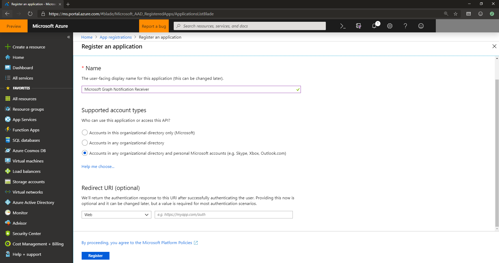
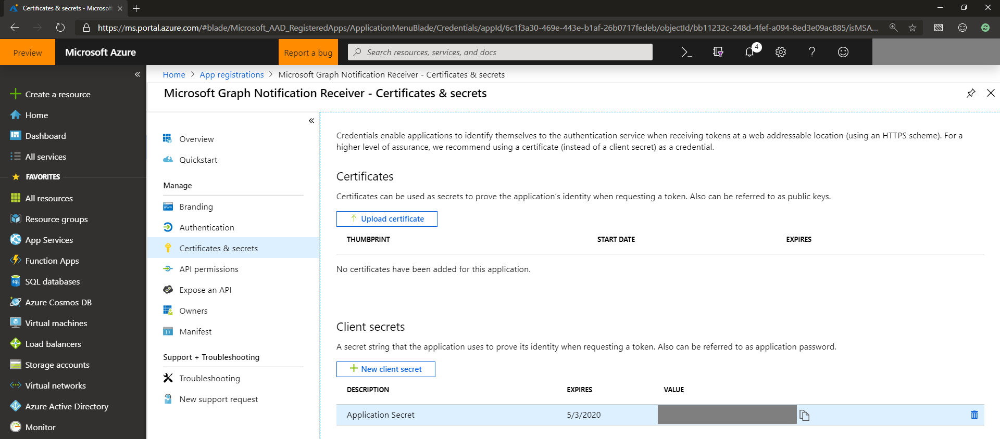
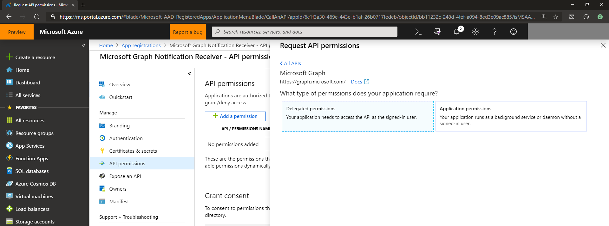
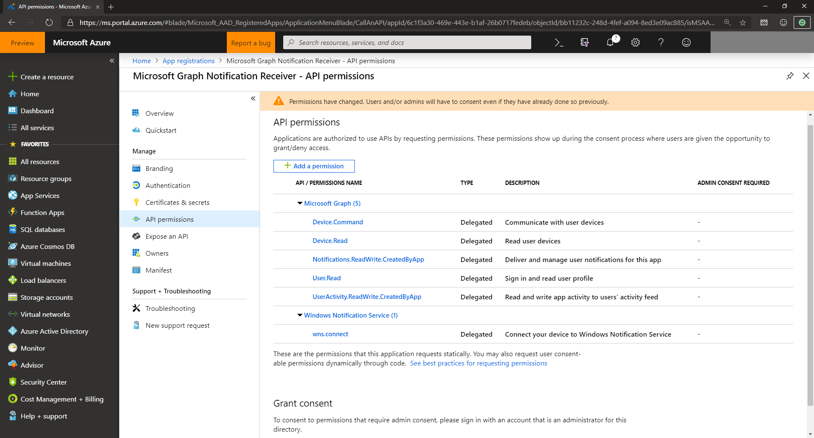

# Application Registration

## Register your application on the Microsoft Azure portal

Let’s start with registering your application on the [Microsoft Azure portal](https://portal.azure.com/#home). For both consumer scenarios using a Microsoft Account (MSA) or school/work scenarios using Azure Active Directory (AAD), authentication registration is required for enabling you application service to send notifications to all endpoints
where users are signed-in to your app. If you’ve previously registered your application on the [Microsoft Application Portal](https://apps.dev.microsoft.com/), don’t worry; your existing apps will show up in the new and improved Azure portal experience.

> [!NOTE]
> If you do not already have an MSA and wish to use one, first register on [account.microsoft.com](https://account.microsoft.com/account). If you're writing an app that needs to use Azure AD v1.0 as a work account or school account authentication and identity framework, visit [Azure Active Directory Authentication Libraries](https://docs.microsoft.com/azure/active-directory/develop/active-directory-authentication-libraries) to learn more. If you’re interested in learning about or using the new converged Microsoft identity platform (v2.0), you will find helpful information at [Comparing the Microsoft identity platform endpoint and Azure AD v1.0 endpoint](https://docs.microsoft.com/en-us/azure/active-directory/develop/azure-ad-endpoint-comparison).

If you haven’t already done so, you’ll now need to register your application via the registration experience on the [Microsoft Azure portal](https://portal.azure.com/#home). Sign-in with your Azure AD account and complete the steps below:

1.  Navigate to “All services” and search for “App registrations” (you can optionally also click the favorite icon to add it to your left navigation menu for quick access)
    
    

2.  Create a “New registration” and select a name and supported account type appropriate to your business, as shown below. You may also optionally provide a redirect URI.
    
    

3.  Once your application has been created, it’ll be given an Application ID/Client ID, as shown below. You’ll need this ID later when registering your cross-device applications in the [Partner Center](https://partner.microsoft.com/).
    

4.  Next, in order to enable your application to identify and authenticate itself when obtaining auth. tokens, you can either upload your own certificate or create a new client secret by navigating to “Certificates & secrets” as shown below.
    
    
    
    > [!NOTE]
	> If you opt to generate a new client secret, be sure to copy and keep it in a safe place as you won’t be able to access it again once you leave the portal.

5.  Next, you will need to add additional permissions required in order to leverage Graph Notifications. Click on “Add a permission” and under Microsoft APIs, select “Microsoft Graph”, followed by “Delegated permissions” as shown below.
    
    
    
    You will need to add the list of permissions as shown below:

  - User.Read - allows your application to sign-in your user

  - Device.Read - allows identification of a user’s list of devices

  - Device.Command - allows communication to a user’s device

  - UserActivity.ReadWrite.CreatedByApp - allows app subscription for
    notification retrieval

  - Notifications.ReadWrite.CreatedByApp - allows notification access
    and delivery

  - wns.connect - allows connecting to windows notification service

  

Now that you’ve completed registration on the Azure portal, you will need to visit [Partner Center/Windows Dev Center](https://partner.microsoft.com/) to setup your application for cross-device experiences and to target your corresponding app platforms for notifications sent through Microsoft Graph.  For next steps, proceed to [Onboarding to cross-device experiences](notif-integration-cross-device-experiences-onboarding). 
