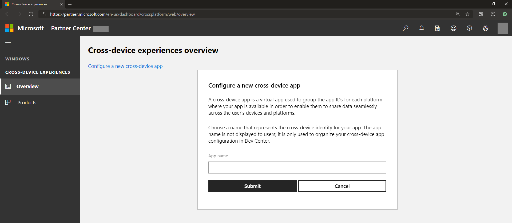
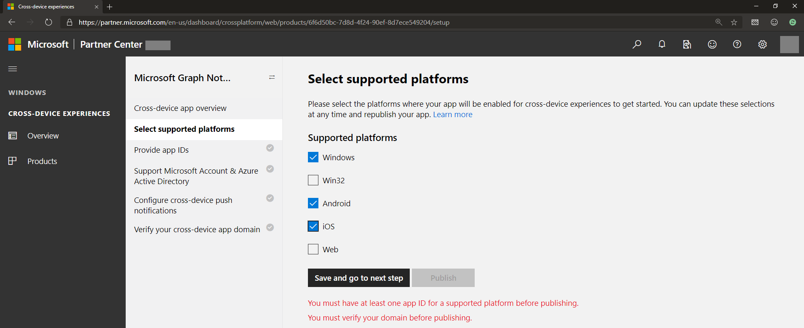
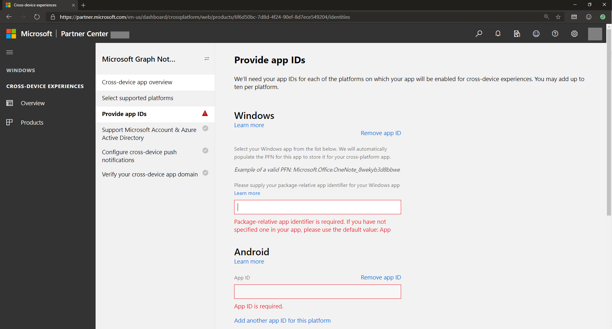
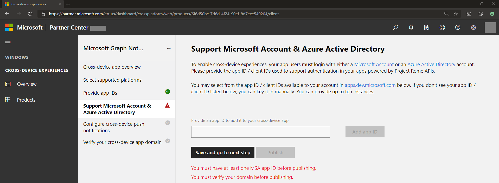
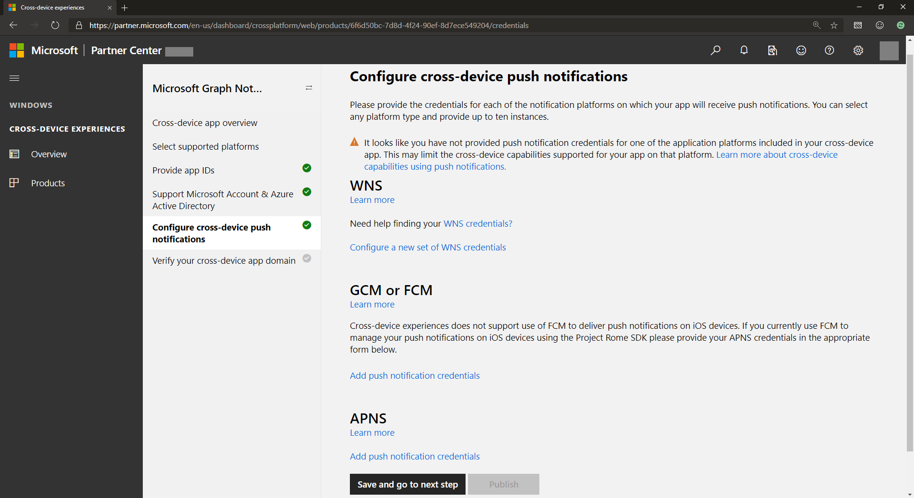
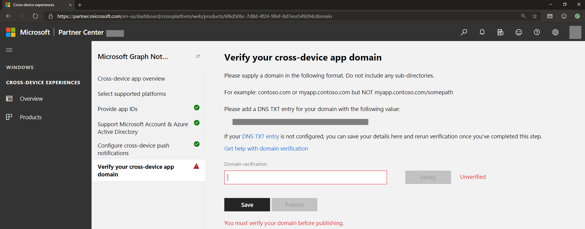

# Onboarding to Cross-device Experiences 

## Register your application in Microsoft Windows Dev Center for cross-device experiences 

Next, you need to register your app on [Partner Center (Windows Dev Center)](https://partner.microsoft.com/). The steps below are required to map platform specific application identities with a single cross-platform application identity that is recognized by Connected Devices Platform (CDP), and authorizes Microsoft Graph to send
notifications using native push notification services corresponding to each OS platform (i.e. WNS, APNS or FCM).

> [!NOTE]
> If you don’t already have a Windows developer account, you’ll need to create one. For details, see [Opening a developer account](https://docs.microsoft.com/en-us/windows/uwp/publish/opening-a-developer-account). You need to do this even if you don’t plan to build a Windows UWP application. If you’re building a school or work application as part of an enterprise, you can associate your developer account with the appropriate Azure AD account that is used for managing your enterprise submissions. For details, see [Associate Azure Active Directory with your Partner Center account](https://docs.microsoft.com/en-us/windows/uwp/publish/associate-azure-ad-with-partner-center).

To get started, sign in to the [Partner Center dashboard](https://partner.microsoft.com/en-us/dashboard) using your Windows developer account (you cannot use an Azure AD account):

1.  On the left menu, go to **Cross-Device Experiences**, select **Configuring a new cross-device app**, and provide your app name, as shown in the following screenshot.

2.  Select all supported platforms where your app will have a presence and be enabled to receive notifications. You can select from supported platforms that include Windows, Android, and iOS, as shown. 

3.  Provide app IDs for each of the platforms where your app has a presence, as shown.

 

> [!NOTE] 
> You can add different IDs (up to ten) per platform – this is in case you have multiple versions of the same app, or even different apps, that want to be able to receive the same notification sent by your app server and targeted to the same user.

4.  Provide or select the app ID from Microsoft account and/or Azure AD app registration. This client ID corresponds to the Microsoft account or Azure AD app registration that you obtained when you register in the Azure Portal.

5.  Microsoft Graph notifications use each of the native notification platforms on all major platforms to send notifications to the app client endpoints, namely, WNS (for Windows UWP), FCM (for Android), and APNS (for iOS). Provide your credentials for these notification platforms to enable Microsoft Graph notifications to deliver notifications for your app server when you publish user-targeted notifications, as shown.

 

> [!NOTE]
> For Windows UWP apps, enabling WNS push notification is a prerequisite to using Microsoft Graph notifications. For details, see [WNS overview](https://docs.microsoft.com/en-us/windows/uwp/design/shell/tiles-and-notifications/windows-push-notification-services--wns--overview). After you onboard, you can provide push credentials via Partner Center to the Connected Device Platform.

6.  Verify your cross-device app domain, which serves as a verification process to prove that your application has ownership of this domain. This acts like a cross-device app identity for the application or applications you registered, as shown.
    
    

That’s it! You've now registered your applications to receive notifications. Next, add the [Project Rome SDK](http://aka.ms/projectRome) to your project on your platform of choice and initialize the Connected Devices Platform. 
