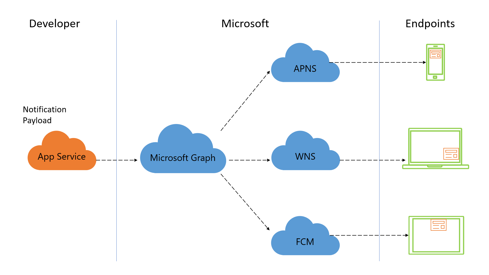

# Introduction

## What is Microsoft Graph notifications?

Notifications are one of the most effective ways to re-engage with users of your application. A great notification experience can help open a near real-time communication channel between you and your application users, that in turn can increase app engagement at the right time, assist users with being more productive and alert them of important events or timely actions that may be required.

Today, users will access your applications and services using a wide variety of platforms and form factors. This heterogenous mix of devices results in additional burden on developers to understand & support multi-platform notification systems, mapping users to endpoints, and maintaining notification state across devices. 

Most other notification offerings eliminate the need to understand and target platform-specific push notification systems but are still inherently designed to target each device. Instead, Microsoft Graph
notifications takes a human-centric approach, providing developers the ability to easily and effectively target their users across any and all device endpoints.

## 

## Why integrate with Microsoft Graph notifications?

Microsoft Graph notifications is a user-centric notification platform that enables developers in 4 key ways today:

### Effortlessly target your user for notification delivery across different endpoints

As part of Microsoft Graph, the notifications API allows you to target a personal Microsoft account (MSA) or a work/school Azure Active Directory (AAD) account to deliver notifications. The platform distributes this
notification to all user endpoints running your application or service, including Windows UWP, Android, and iOS. This capability helps maximize outreach by ensuring appropriate notifications can reach your target, wherever they may be.

### Easily manage notifications across endpoints

Using the [Project Rome SDK](http://aka.ms/projectRome) within your client application, you can update the state of a notification and sync that state across all endpoints. For example, when a user acts on a notification on one device, you can update the state of this notification (such as marking it as read or dismissed), and the same state change will be distributed to all other endpoints. The Microsoft Graph notifications API tracks the state of your user’s notifications in a centralized way, making it easy for you to ensure that your notifications are handled once, and dismissed everywhere, thereby minimizing redundancy and ensuring a great customer experience.

### Retrieve notification state & history

You can use the notifications API to retrieve notification history based on an expiration time you define (up to 30 days). Notifications that are marked as read or dismissed are still retrievable from the history, enabling in-app views of notification history as well as enabling you to build on insights and intelligence.

### Privacy and compliance

Microsoft Graph notifications meets most enterprise compliance requirements, including ISO 27001, ISO 27018, EUMC, HIPAA, SOC 1, SOC 2 and of course GDPR.

## How do I get started?

To get started, visit the [integration overview](https://docs.microsoft.com/en-us/graph/notif-integration-e2e-overview) section to see how you can quickly and easily leverage and integrate user-centric notifications within your application.
