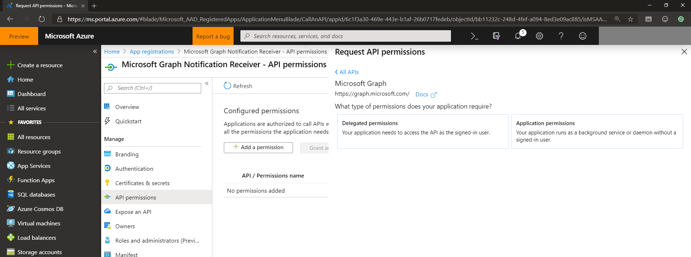
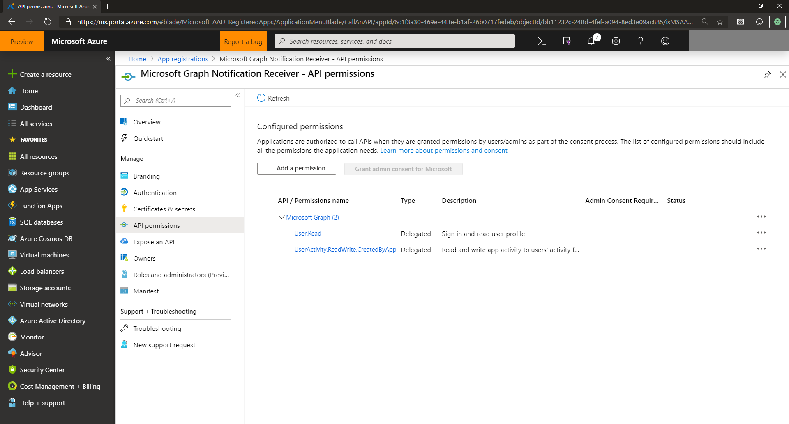

# Manage app registration and API permission for Microsoft Graph notifications

In order for your application service to integrate with Microsoft Graph notifications, you need to register your app with the Microsoft identity platform to support Microsoft accounts or work or school accounts, and declare the API permissions that are required.

## Register your app to support Microsoft accounts or work or school accounts

Register your application on the [Microsoft Azure portal](https://portal.azure.com/#home) to support Microsoft accounts or work or school accounts. If you’ve previously registered your application on the [Microsoft Application Portal](https://apps.dev.microsoft.com/), your existing apps will show up in the new and improved Azure portal experience.

For information about how to register your apps, see [Register an application with the Microsoft identity platform](auth-register-app-v2.md). When you register your app, be sure to keep the application ID/client ID somewhere handy. You'll need this ID later when you register your application for cross-device experiences in the [Microsoft Partner Center](https://partner.microsoft.com/) for Windows, Android or iOS clients.

> [!NOTE]
> If you don't already have a Microsoft account and would like to use one, go to the [Microsoft account](https://account.microsoft.com/account) page. If you're writing an app that needs to use Azure AD v1.0 as an authentication and identity framework for work or school accounts, see [Azure Active Directory Authentication Libraries](https://docs.microsoft.com/azure/active-directory/develop/active-directory-authentication-libraries). If you’re interested in learning about or using the new converged Microsoft identity platform (v2.0), see [Comparing the Microsoft identity platform endpoint and Azure AD v1.0 endpoint](https://docs.microsoft.com/en-us/azure/active-directory/develop/azure-ad-endpoint-comparison).

## App certificates and secrets

To enable your application to identify and authenticate itself when obtaining auth tokens, you can either upload your own certificate or create a new client secret by going to **Certificates & secrets** in the Azure portal.
    

    
> [!NOTE]
> If you opt to generate a new client secret, be sure to copy and keep it in a safe place. You won’t be able to access it again after you leave the portal.

## API permissions

You'll need to add additional permissions in order to use Microsoft Graph notifications. Choose **Add a permission**, and under Microsoft APIs, select **Microsoft Graph**, and then select **Delegated permissions**.
    

    
Add the following permissions:

- User.Read - allows your application to sign-in your user

- UserActivity.ReadWrite.CreatedByApp - allows app subscription for notification retrieval

## Next steps

Learn more about [permissions and consent](https://docs.microsoft.com/en-us/azure/active-directory/develop/v2-permissions-and-consent) or see the Microsoft Graph [permissions reference](https://docs.microsoft.com/en-us/graph/permissions-reference).

Now that you’ve registered your app, visit [Partner Center](https://partner.microsoft.com/) to set up your application and target your corresponding app platforms (Windows, iOS or Android) for notifications sent via Microsoft Graph. For details, see [Onboarding to cross-device experiences](notifications-integration-cross-device-experiences-onboarding.md). 

>[!NOTE]
>If you're only targeting web endpoints, you can skip Partner Center registration and go to the next section to learn more about setting up your [App Service](notifications-integrating-app-server.md) to send notifications.
