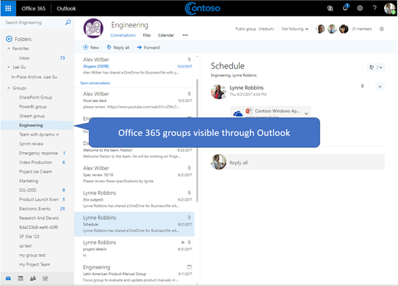

# Overview of Office 365 groups in Microsoft Graph

 
Office 365 groups provide the foundational membership service for users to share conversations, files, notes, calendars, plans, and many other assets. 

## Why integrate with Office 365 groups?   

Groups form the fundamental construct enabling user collaboration and integration across services to support rich scenarios in task planning, teamwork, education, and more. Integrating with Office 365 groups provides your application the ability to support millions of users as they transition across various experiences in the Office 365 suite and beyond.  
 
### Create groups to facilitate teamwork across services 
 
Using Microsoft Graph API, you can create, manage, or delete groups throughout the lifecycle of collaboration. Office 365 groups form the foundational container for all teamwork scenarios: 
 
- You can use the [Create group](../../../api-reference/v1.0/api/group_post_groups.md) API to provision a new group.  
 
- The group is then made available in a range of applications, such as Outlook, SharePoint, Teams, Planner, and even Microsoft Stream. Microsoft Graph makes sure membership is synchronized across these connected services to seamlessly provide access to all group members.  
 
    **Every Office 365 group is integrated with a default set of Office 365 services**

      

- Members can indicate a group is one of their [favorites](../api-reference/v1.0/api/group_addfavorite.md), or [remove it from their favorites](../../api-reference/v1.0/api/group_removefavorite.md) if no longer needed. 
 
- Group conversations can be [created](../../api-reference/v1.0/api/group_post_conversations.md), [retrieved](../../api-reference/v1.0/api/group_get_conversation.md), or [deleted](../../api-reference/v1.0/api/group_delete_conversation.md) from your custom application. 
 
- Calendar [events](../../api-reference/v1.0/resources/event.md) can be scheduled on the group calendar using Microsoft Graph. 
 
- Each group has an associated [SharePoint site](../../api-reference/v1.0/resources/sharepoint.md). Microsoft Graph can be used to retrieve information [about the site](../../api-reference/v1.0/resources/site.md), such as document library [lists](../../api-reference/v1.0/api/list_list.md) or [subsites](../../api-reference/v1.0/api/subsites_list.md). 
 
- Microsoft Graph can be used to [create a plan](../../api-reference/v1.0/api/planner_post_buckets.md) in Microsoft Planner which is owned by a group. The plan provides a visual way to track teamwork by allowing you to [create tasks](../../api-reference/v1.0/api/planner_post_tasks.md) that can be [organized across buckets](../../api-reference/v1.0/api/planner_post_buckets.md). 
 
- Every group has a [OneNote](integrate_with_onenote.md) available that can be used for collecting meeting notes and organizing ideas. 
  
    **Office 365 groups and conversations accessible in Outlook in the web**

     

- A [group can be enabled for Microsoft Teams](../../api-reference/beta/api/team_put_teams.md) (preview) to allow group members to engage in persistent chat.  
 
- Groups can also be deleted through Microsoft Graph by using the [Delete group](../../api-reference/v1.0/api/group_delete.md) API. When a group is deleted, all associated content is also deleted, which avoids orphaned sites, conversations, or plans. 
 
### Manage group membership seamlessly 
 
Office 365 groups are collections of users who share access to resources in Microsoft services or within your app. Because group membership is managed centrally, any changes to membership affect all services associated with the group. 
 
- Using the Microsoft Graph, members can be [added](../../api-reference/v1.0/api/group_post_members.md) and [removed](../../api-reference/v1.0/api/group_delete_members.md) from an existing group. 
 
- A [list of owners](../../api-reference/v1.0/api/group_list_owners.md) or a [list of members](../../api-reference/v1.0/api/group_list_members.md) can be retrieved for a group. This helps communicate who has access to group content, or who may need to perform administrative duties, such as renewing the group or approving a join request. 
 
- Groups can be designated as **Public**, where group content is visible to anyone in the same organization, or groups can be **Private**, where group content is only visible to members. Group privacy settings [can be updated](../../api-reference/v1.0/api/group_update.md) through Microsoft Graph. 
 
- Owners who are no longer participating in the ownership responsibilities for a particular group [can be removed](../../api-reference/v1.0/api/group_delete_owners.md) from the list of group owners. 
 
### Governance  
 
As the number of groups created within an organization begins to grow, Microsoft Graph supports the ability to govern the usage and lifecycle of the group. Using Microsoft Graph, you can enforce group policies across all groups within an organization.

- Microsoft Graph can be used to configure a broad range of [group policy settings](../../api-reference/v1.0/resources/groupsetting.md) which help define behaviors, such as automatically deleting groups unless they are renewed by an owner and enforcing naming policies on Office 365 groups. 
 
- Groups that are about to expire [can be renewed](../../api-reference/v1.0/api/group_renew.md) to allow team members to continue with collaboration and accessing content. If the group is not renewed in line with the expiration policy established, the group is automatically deleted. 
 
- Deleted groups [can be restored](../../api-reference/v1.0/api/directory_deleteditems_restore.md) by using the **Restore deleted item** functionality in Microsoft Graph. 
 
## Next steps

- Start using the [Microsoft Graph Explorer](https://developer.microsoft.com/en-us/graph/graph-explorer) to experiment with sample API requests. 
- Learn how to build and publish your app to make it available in [Microsoft Teams](https://dev.office.com/teams).
- Research how your app can be integrated with [SharePoint](https://developer.microsoft.com/en-us/sharepoint) for document collaboration.  
- Look at how [Office 365 Connectors](https://docs.microsoft.com/en-us/outlook/actionable-messages/) can be used to extend group functionality in Outlook. 

