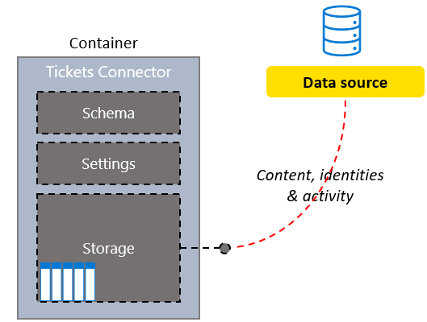

# Create, update, and delete connections to the Microsoft Graph Connection

Connections from external services to the Microsoft Search service are represented by the [externalConnection](/graph/api/resources/externalconnection?view=graph-rest-beta) resource in Microsoft Graph.

The Graph Connectors platform offers a simple way to add your external data into the Microsoft Graph. A connection is a logical container for your external data that an administrator can manage as a single unit in the Graph Connectors platform.
Once a connection has been created, you can add your content from any external data source such as an on-premises content source or an external SaaS service. You can only view and manage the connections you created or were explicitly authorized to manage. A search admin can view and manage all the connections in the tenant from the Modern Admin Center.

*Sample custom helpdesk system Tickets Connector Structure*

*Admin View of Connections including the custom Tickets Connector*

You can model a connection anyway you want, but creating one connection for every instance of your connector is the most common model. For example, each time you set up the Microsoft-built Windows file share connector, a new connection is created. You can also create a single connection to add all items from your data source. For example, creating a single connection to add all the tickets and incidents across multiple teams from your helpdesk system

[Search API Preview Signup](../includes/search-api-preview-signup.md)

A connection allows your application to [define a schema](/graph/api/externalconnection-post-schema?view=graph-rest-beta) for items that will be indexed, and provides an endpoint for your service to [add, update, or delete items from the index](search-index-manage-items.md). Creating a connection is the first step for an application to add items to the search index.

## States and Operations
Your connection could exist in one of the following states. 

| State                  |  Description    
|-------------------|--------|------------|--------|--------|--|--------|------|--------|--------|--|--------|--------|--------|--------|
| **Draft**         | An empty connection is provisioned. The data source, schema, or any settings have not been configured yet.         |
| **Ready**         | The connection is provisioned with registered schema and is ready for ingestion.     
| **Obsolete**      | This occurs when a dependent feature, such as an API, has been deprecated. Deleting the connection is the only valid operation.      
| **LimitExceeded** | If you hit the maximum limit of a single connection or the tenant level quota across all connections, you cannot add more items until you exit the state.      

| State                  |        | Connection |        |        |  |        | Item |        |        |  |        | Schema |        |        |
|-------------------|--------|--------|--------|--------|--|--------|------|--------|--------|--|--------|--------|--------|--------|
|                   | Create | Read | Update | Delete |  | Create | Read | Update | Delete |  | Create | Read | Update | Delete |
| **Draft**         | ×      | ✓     | ✓    | ✓      |  | ×      | ×    | ×      | ×      |  | ✓      | ×      | ×      | ×      |
| **Ready**         | ✓     | ✓    | ✓      | ✓      |  | ✓      | ✓    | ✓      | ✓      |  | ×      | ✓     | ×      | ×      |
| **Obsolete**      | ×      | ✓      | ×      | ✓      |  | ×      | ✓    | ×      | ×      |  | ×      | ✓      | ×      | ×      |
| **LimitExceeded** | ✓      | ✓          | ✓      | ✓      |  | ×      | ✓    | ✓      | ✓      |  | ×      | ✓      | ×      | ×      |

## Create a connection

Before an application can add items to the search index, it must create and configure a connection using the following steps.

- [Create a connection](/graph/api/external-post-connections?view=graph-rest-beta) with a unique ID, display name, and description.
- [Register a schema](/graph/api/externalconnection-post-schema?view=graph-rest-beta) to define the fields that will be included in the index.

> [!IMPORTANT]
> Once a schema has been registered, it cannot be changed for an existing connection.

## Update a connection

You can change the display name or description of an existing connection by [updating the connection](/graph/api/externalconnection-update?view=graph-rest-beta).

## Delete a connection

You can [delete a connection](/graph/api/externalconnection-delete?view=graph-rest-beta), and remove all items that were indexed via that connection.

## Next steps

- [Why use the Microsoft Search API?](search-concept-overview.md#why-use-the-microsoft-search-api)
- [Review the Indexing API reference](/graph/api/resources/indexing-api-overview?view=graph-rest-beta)
- [Overview for Microsoft Graph Connectors](/microsoftsearch/connectors-overview)
- Download the [sample search connector](https://github.com/microsoftgraph/msgraph-search-connector-sample) from GitHub
