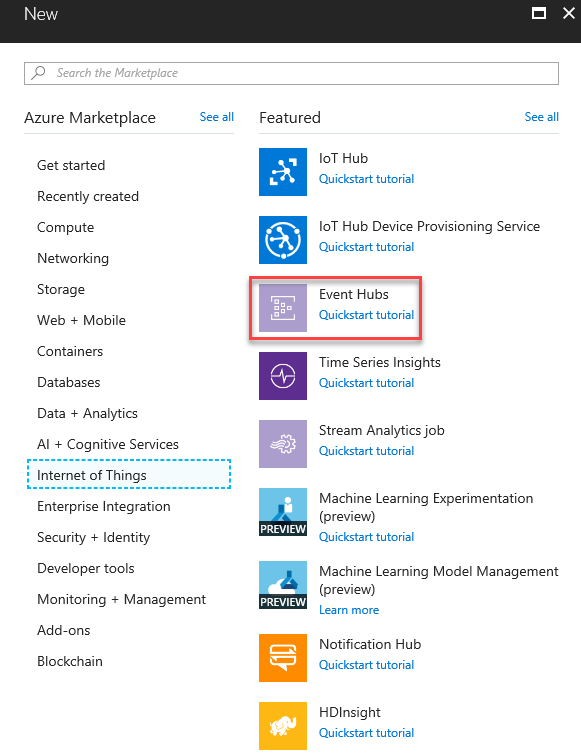
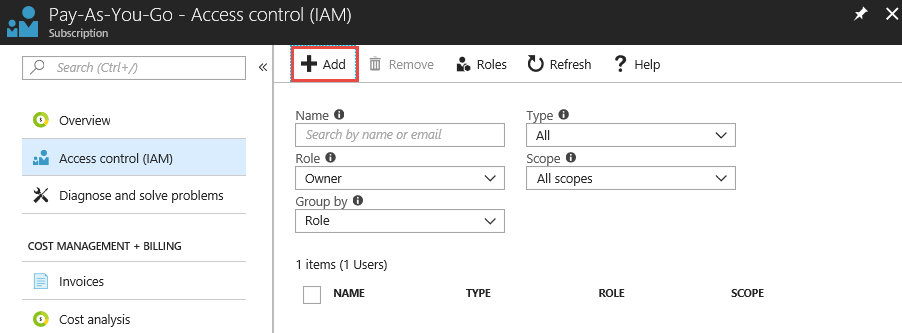
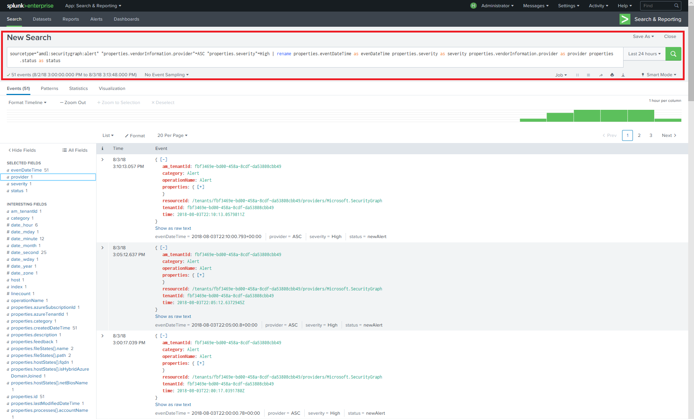
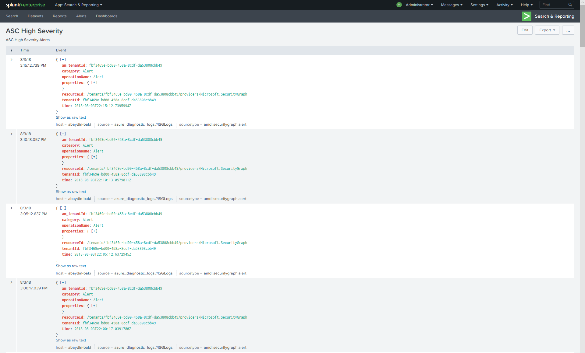

# Integrate Microsoft Graph Security API alerts with your SIEM using Azure Monitor

The Microsoft Graph Security providers can be managed through a single REST endpoint. This endpoint can be configured to [Azure Monitor](https://docs.microsoft.com/en-us/azure/monitoring-and-diagnostics/) which supports connectors to several SIEM products. The instructions in Steps 1 and 2 of this article refer to all Azure Monitor connectors that support consumption via event hubs. This article describes the end-to-end integration of the [Splunk](https://splunkbase.splunk.com/) SIEM connector.

The integration process involves the following steps:

1. [Set up Azure event hub to receive security alerts for your tenant](#step-1-set-up-an-event-hubs-namespace-in-azure-to-receive-security-alerts-for-your-tenant)
2. [Configure Azure Monitor to send security alerts from your tenant to the event hub](#step-2-configure-azure-monitor-to-send-security-alerts-from-your-tenant-to-the-event-hub)
3. [Download and install the Azure Monitor Add-on for Splunk which will allow Splunk to consume security alerts](#step-3-download-and-install-the-azure-monitor-add-on-for-splunk-which-will-allow-splunk-to-consume-security-alerts)
4. [Register an application with your tenant Azure Active Directory which Splunk will use to read from the event hub](#step-4-register-an-application-with-your-tenant-azure-active-directory-which-splunk-will-use-to-read-from-the-event-hub )
5. [Create an Azure Key vault to store the access key for the event hub](#step-5-create-an-azure-key-vault-to-store-the-access-key-for-the-event-hub)
6. [Configure the Splunk data inputs to consume security alerts stored in the event hub](#step-6-configure-the-splunk-data-inputs-to-consume-security-alerts-stored-in-the-event-hub)

After you complete these steps, your Splunk Enterprise will consume security alerts from all the Microsoft Graph integrated security products for which your tenant is licensed. Any new security products that you license will also send alerts through this connection, in the same schema with no further integration work needed.

## Step 1: Set up an Event Hubs namespace in Azure to receive security alerts for your tenant

To begin, you need to create a [Microsoft Azure Event Hubs](https://docs.microsoft.com/en-us/azure/event-hubs/) namespace and event hub. This namespace and event hub is the destination for all your organization’s security alerts. An Event Hubs namespace is a logical grouping of event hubs that share the same access policy. Note a few details about the Event Hubs namespace and event hubs that you create:

- We recommend using a Standard Event Hubs namespace, particularly if you are sending other Azure monitoring data through these same event hubs.
- Typically, only one throughput unit is necessary. If you need to scale up as your usage increases, you can always manually increase the number of throughput units for the namespace later or enable auto inflation.
- The number of throughput units allows you to increase throughput scale for your event hubs. The number of partitions allows you to parallelize consumption across many consumers. A single partition can do up to 20MBps, or approximately 20,000 messages per second. Depending on the tool consuming the data, it may or may not support consuming from multiple partitions. If you're not sure about the number of partitions to set, we recommend starting with four partitions.
- We recommend that you set message retention on your event hub to 7 days. If your consuming tool goes down for more than a day, this ensures that the tool can pick up where it left off (for events up to 7 days old).
- We recommend using the default consumer group for your event hub. You don't need to create other consumer groups or use a separate consumer group unless you plan to have two different tools consume the same data from the same event hub.
- Typically, port 5671 and 5672 must be opened on the machine consuming data from the event hub.

Also see the [Azure Event Hubs FAQ](https://docs.microsoft.com/en-us/azure/event-hubs/event-hubs-faq).

1. Log on to the [Azure portal](https://portal.azure.com/) and choose **Create a resource** at the top left of the screen.

    

2. Select **Internet of Things** and choose **Event Hubs**.

    

3. In **Create namespace**, enter a namespace name. After making sure the namespace name is available, choose the pricing tier (Basic or Standard). Also, choose an Azure subscription, resource group, and location in which to create the resource. Choose **Create** to create the namespace. You might have to wait a few minutes for the system to fully provision the resources.

    

## Step 2: Configure Azure Monitor to send security alerts from your tenant to the event hub

Enabling the streaming of your organization’s security alerts through Azure Monitor is done one time for your entire Azure Active Directory (Azure AD) tenant. All Microsoft Graph Security API licensed and enabled products will begin sending security alerts to Azure Monitor, streaming data to consuming applications. Any additional Microsoft Graph Security API-enabled products licensed and deployed by your organization will automatically stream security alerts through this same Azure Monitor configuration. No further integration work is needed from the organization.

Security alerts are highly privileged data typically viewable only by security response personnel and global administrators within an organization. For this reason, the steps required to configure the integration of a tenant’s security alerts with SIEM systems require an Azure AD Global Administrator account. This account is only needed one time, during setup, to request your organization’s security alerts be sent to Azure Monitor.

> **Note:** Currently, the Azure Monitor Diagnostic settings blade does not support configuration of tenant-level resources. Microsoft Graph Security API alerts are a tenant-level resource, which requires using the Azure Resource Manager API to configure Azure Monitor to support consumption of your organization’s security alerts.

1. In your Azure subscription, register "microsoft.insights" (Azure Monitor) as a resource provider.  
> **Note:** Do not register "Microsoft.SecurityGraph" (Microsoft Graph Security API) as a resource provider in your Azure subscription, as “Microsoft.SecurityGraph” is a tenant-level resource as explained above. Tenant level configuration will be part of #6 below.

2. To configure Azure Monitor using the Azure Resource Manager API, obtain the [ARMClient](https://github.com/projectkudu/ARMClient) tool. This tool will be used to send REST API calls to the Azure portal from a command line.

3. Prepare a diagnostic setting request JSON file like the following:

    ``` json
    {
      "location": "",
      "properties": {
        "name": "securityApiAlerts",
        "serviceBusRuleId": "/subscriptions/SUBSCRIPTION_ID/resourceGroups/RESOURCE_GROUP/providers/Microsoft.EventHub/namespaces/EVENT_HUB_NAMESPACE/authorizationrules/RootManageSharedAccessKey",
        "logs": [
          {
            "category": "Alert",
            "enabled": true,
            "retentionPolicy": {
              "enabled": true,
              "days": 7
            }
          }
        ]
      }
    }
    ```

  Replace the values in the JSON file as follows:
  * **SUBSCRIPTION_ID** is the Subscription ID of the Azure subscription hosting the resource group and event hub namespace where you will be sending security alerts from your organization.
  * **RESOURCE_GROUP** is the resource group containing the event hub namespace where you will be sending security alerts from your organization.
  * **EVENT_HUB_NAMESPACE** is the event hub namespace where you will be sending security alerts from your organization.
  * **“days”:** is the number of days you want to retain messages in your event hub.

4. Save the file as JSON to the directory where you will invoke ARMClient.exe. For example, name the file **AzMonConfig.json.**
5. Run the following command to sigh in to the ARMClient tool. You will need to be using Global Administrator account credentials.

    ``` shell
    ARMClient.exe login
    ```

6. Run the following command to configure Azure Monitor to send security alerts to your event hub namespace. This will automatically provision an event hub within the namespace and start the flow of security alerts into the event hub. Ensure that the setting name (in this example, **securityApiAlerts**) matches the setting name you specified in the JSON file for the **name** field.

    ``` shell
    ARMClient.exe put https://management.azure.com/providers/Microsoft.SecurityGraph/diagnosticSettings/securityApiAlerts?api-version=2017-04-01-preview  @".\AzMonConfig.json"
    ```

7. To verify the settings were applied correctly, run this command and verify that the output matches your JSON file settings.

    ``` shell
    ARMClient.exe get https://management.azure.com/providers/Microsoft.SecurityGraph/diagnosticSettings/securityApiAlerts?api-version=2017-04-01-preview
    ```
8. Exit the ARMClient tool. You have now completed the configuration of Azure Monitor to send security alerts from your tenant to event hub.

## Step 3: Download and install the Azure Monitor Add-on for Splunk which will allow Splunk to consume security alerts

1. This integration only supports [Splunk Enterprise](https://splunkbase.splunk.com/) deployments.
2. Download and install the [Azure Monitor Add-on for Splunk](https://github.com/Microsoft/AzureMonitorAddonForSplunk). For detailed installation instructions, see [Installation](https://github.com/Microsoft/AzureMonitorAddonForSplunk/wiki/Installation). **Only Azure Monitor Add-on for Splunk version 1.2.9 or higher is supported.**
3. After successfully installing the Add-on, follow the configuration steps described in the [Azure Monitor add-on configuration wiki](https://github.com/Microsoft/AzureMonitorAddonForSplunk/wiki/Configuration-of-Splunk ) to configure Splunk.
4. As indicated in the Add-on installation instructions, the add-on will work by doing a disable/enable cycle on the Manage Apps page in Splunk Web. Or, you can restart Splunk.

## Step 4: Register an application with your tenant Azure Active Directory which Splunk will use to read from the event hub

Splunk needs an application registration in your organization’s Azure Active Directory to be granted the required permissions and app credentials required to authenticate to the Azure Monitor event hub.

1. In the Azure portal, go to **App Registrations** and select **New application registration**.

    

2. Select a name for your application, choose **Web app / API** for the type, and **`http://localhost`** for the sign-on URL. Then select **Create**.

    

3. After the application is created, copy the **Application ID** and save for later use configuring the Splunk data inputs. Then go to the application settings and choose **Keys**.

    

    This will allow you to generate a new key, known as an Application Secret. After it's generated, copy the **Application Secret** and save for later use configuring the Splunk data inputs.

4. Grant the application the role of **Reader** in the Azure subscription containing the event hub with your organization’s security alerts.

    

    Select your subscription, choose **Access control (IAM)**. Select **Add** to add permissions. Select your application and choose the **Role** of **Reader** for your application.

    

    Select **Save** to add the permissions granted to your application to the subscription.

## Step 5: Create an Azure Key vault to store the access key for the event hub

Azure key vaults are used to store secrets such as identities, passwords, and certificates for use at runtime by applications. In this step you will create an Azure key vault to store the secrets needed for Splunk to connect and read from the Azure event hubs containing your organization’s security alerts.

1. In the Azure portal, go to **Key vaults** and select **Add**.

    

2. When creating the new key vault, select **Access policies** to add a new access policy for the application you just registered in Step 4. Grant the **Get** secret permissions to your application. This will allow Splunk, acting as the registered application, to access the keys (secrets) stored in this Azure key vault.

    

    Select **Create** to complete the creation of your new Azure key vault.

3. Generate a new secret in your key vault to store the access key to your event hub namespace. First, grab the access key to your event hub namespace by opening your event hub namespace and selecting **Shared access policies**. Select the **RootManageSharedAccessKey** policy from the list and copy the **Primary Key** from the list.

    

4. Open your key vault and select **Secrets**. Choose **Generate/Import** to add a new secret to the key vault. Paste in the **Primary key** from the event hub namespace **RootManageSharedAccessKey**.

    

5. After it's created, select the secret and copy the **Secret Version** of the secret. This will be used later in Step 6 to configure Splunk data inputs.

    

## Step 6: Configure the Splunk data inputs to consume security alerts stored in the event hub

The last step to complete the setup process is to configure Splunk data inputs to utilize the event hub, application, and secrets you created in previous steps.

1. Follow the instructions in the [Configuration of Splunk](https://github.com/Microsoft/AzureMonitorAddonForSplunk/wiki/Configuration-of-Splunk) topic to open and configure Splunk data inputs for the Azure Monitor Add-on. Go to **Settings** and **Data Inputs**. Choose **Azure Monitor Diagnostic Logs**.
2. Select **New** and input all the required fields using the values obtained in the previous steps. The following image shows all the required fields using the values from the previous examples in this article.

    

3. Select **Next** and begin searching your organization’s security alerts ingested from Azure Monitor.

## (Optional) Use Splunk Search to explore data

After you have set up the Azure Monitor Splunk plugin, your Splunk instance will start retrieving events from the configured event hub. By default, Splunk will index each property of the Microsoft Graph Security API alert schema to allow searching.

To search for Microsoft Graph Security API alerts, to create dashboards, or to set Splunk alerts with your search query, navigate to apps -> Search & Reporting app in Splunk.

**Examples**:<br/>
Try searching Graph Security alerts:

- Type `sourcetype="amdl:securitygraph:alert"` in the search bar to get all alerts surfaced through the Microsoft Graph Security API. On the right-hand side, you will see the top-level properties of Azure Monitor log where Graph Security alert is under properties field.<br/>
- On the left pane, you will see selected fields and interesting fields. You can use selected fields to create dashboards or Splunk alerts, you can also add or remove selected fields by right-clicking on the fields.  
> **Note:**
As shown in the following search query, you can restrict your search as needed. In the example, we filter the Graph Security Alerts by high severity alerts from Azure Security Center. We also used `eventDatetime`, `severity`, `status`, and `provider` as selected fields to be displayed. For more advance search terms, see [Splunk search tutorials](http://docs.splunk.com/Documentation/Splunk/7.1.2/SearchTutorial/WelcometotheSearchTutorial).

 
> Search query: `sourcetype="amdl:securitygraph:alert" "properties.vendorInformation.provider"=ASC "properties.severity"=High | rename properties.eventDataTime as eventDateTime properties.severity as severity properties.vendorInformation.provider as provider properties.status as status`

Splunk also allows multiple actions on search results using the "Save As" menu option in top right of the screen. You can create Reports, Dashboard Panels, or Alerts based on your search filter.
Below is an example of a dashboard with an event stream based on the previous query:
You can add a drilldown link to each event to further access the details on Microsoft Graph site. See [Splunk drilldown documentation](http://docs.splunk.com/Documentation/Splunk/7.1.2/Viz/DrilldownIntro).

 

Or you can create a dashboard as a timeline chart:

 

You can follow [Splunk Search & Report tutorial](http://docs.splunk.com/Documentation/Splunk/7.1.2/SearchTutorial/WelcometotheSearchTutorial) for more details.
