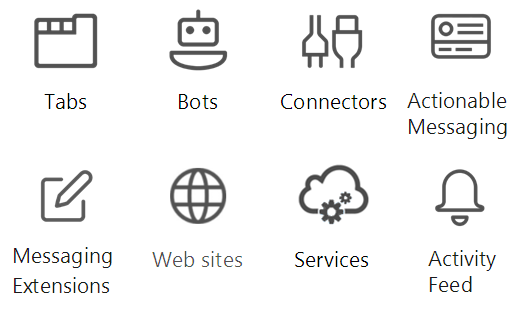

# Microsoft Teams API overview

[Microsoft Teams](https://products.office.com/microsoft-teams) is the ultimate hub for teamwork and intelligent communications. 
Built on the strength and scale of [Office 365](https://products.office.com/) with over 120 million users, 
Microsoft Teams delivers chat-based collaboration, meetings, calling, and enterprise voice features.

## Why integrate with Microsoft Teams?

### Automate team lifecycles

Use Microsoft Graph to [create a new virtual team](../api-reference/v1.0/api/team_put_teams.md) when a new business issue arises, 
[add the right people](../api-reference/v1.0/api/group_post_members.md) to the team, 
and configure the team with 
[channels](../api-reference/v1.0/api/channel_post.md),
[tabs](../api-reference/v1.0/api/teamstab_add.md),
and [apps](../api-reference/v1.0/api/teamsappinstallation_add.md).
If you want to get the new team together to discuss the business issue, 
[add a new event](../api-reference/v1.0/api/group_post_events.md) to the team calendar.

When the business issue is resolved and you no longer need the team, 
use the Microsoft Teams API to [archive](../api-reference/v1.0/api/team_archive.md)
or [delete](../api-reference/v1.0/api/group_delete.md) the team. 
If you know the maximum duration of the team when you create it, 
set an [Office 365 group expiration policy](https://support.office.com/en-us/article/office-365-group-expiration-policy-8d253fe5-0e09-4b3c-8b5e-f48def064733?ui=en-US&rs=en-US&ad=US)
for the team that automatically removes the team according to the policy.

### Get work done even when no one is around

Use [application permissions](permissions_reference.md) to work with 
[teams](../api-reference/v1.0/resources/team.md), [channels](../api-reference/v1.0/resources/channel.md),
[tabs](../api-reference/v1.0/resources/teamstab.md), and [apps](../api-reference/v1.0/resources/teamsapp.md)
without human intervention. 
Create a new channel when your customer files an order.
Automatically create teams for classes at the beginning of the school year, and archive them at the end.

### Create teams linked to your app

Let customers to create new [teams](../api-reference/v1.0/resources/team.md) and [channels](../api-reference/v1.0/resources/channel.md). 
[Install](../api-reference/v1.0/api/teamsappinstallation_add.md) your 
[Teams app](https://docs.microsoft.com/en-us/microsoftteams/platform/#pivot=home&panel=home-all) in the new teams. 
[Pin your app to a tab](../api-reference/v1.0/api/teamstab_add.md) in the new channel. 
[Send messages](../api-reference/beta/api/channel_post_chatthreads.md) to the channel linking back to your website.

### Create and manage multiple teams and channels

Microsoft Graph makes it easy to create large numbers of teams and populate them with users and channels,
by automate creating and managing [teams](../api-reference/v1.0/resources/team.md), [channels](../api-reference/v1.0/resources/channel.md),
[tabs](../api-reference/v1.0/resources/teamstab.md), and [apps](../api-reference/v1.0/resources/teamsapp.md).
Microsoft Graph also lets you [find](teams_list_all_teams.md) 
and [archive](../api-reference/v1.0/api/team_archive.md)
the teams you are no longer using. 
This is the same API that the [Microsoft Teams Admin Center](https://docs.microsoft.com/en-us/microsoftteams/enable-features-office-365)
and [Teams PowerShell commandlets](https://docs.microsoft.com/en-us/microsoftteams/teams-powershell-overview) are built on.

### Deploy apps to teams

[List the teams in your tenant](teams_list_all_teams.md), 
and [install apps](../api-reference/v1.0/api/teamsappinstallation_add.md) to them. 
[Create tabs](../api-reference/v1.0/api/teamstab_add.md) in channels to give users easy access to apps.

### Use Microsoft Graph in any kind of app

Microsoft Teams apps give work groups a new tool to make collaboration a more productive and compelling experience. These apps let work group users share assets, interact through chat, and schedule events on the team calendar. These apps can also automate creating teams, channels, and conversations, enhancing the value of Microsoft Teams.

You can create web sites, services, and native platform applications that run outside the Microsoft Teams user experience, and call the Teams API to automate Teams scenarios.

**Types of apps enabled for Microsoft Teams**

These collaboration tools include Microsoft Graph-enabled tabs or bots running inside Microsoft Teams apps. You can also call Microsoft Graph outside of a Microsoft Teams app, such as from a website or a web service. If you've already enabled your website for Microsoft Graph, you can use that work for Microsoft Teams by using the [Microsoft Teams developer platform](https://docs.microsoft.com/en-us/microsoftteams/platform/#pivot=home&panel=home-all) to [create a tab](https://docs.microsoft.com/en-us/microsoftteams/platform/concepts/tabs/tabs-overview) that uses the existing website code.

Microsoft Teams APIs can enhance apps inside and outside of Teams:

|App type|Scenario description|
|:-------|:-------------------|
| [Tabs](https://docs.microsoft.com/en-us/microsoftteams/platform/concepts/tabs/tabs-overview) |Surface your content in Microsoft Teams.|
| [Bots](https://docs.microsoft.com/en-us/microsoftteams/platform/concepts/bots/bots-overview) |Help users get tasks done in conversations.|
| [Connectors](https://docs.microsoft.com/en-us/microsoftteams/platform/concepts/connectors/connectors) |Post updates from external services to channels.|
| [Actionable messaging](https://docs.microsoft.com/en-us/microsoftteams/platform/concepts/cards/cards) |Add enhanced interaction to your connector cards.|
| [Messaging extensions](https://docs.microsoft.com/en-us/microsoftteams/platform/concepts/messaging-extensions) |Allow users to query and share information in conversations.|
|Websites| Surface enhanced content in your web pages.|
|Services|Enhance your client applications with Microsoft Graph data via your web service.|
| [Activity feed](https://docs.microsoft.com/en-us/microsoftteams/platform/concepts/activity-feed)|Engage users via feed notifications.|
| [Calling and online meetings (Preview)](../api-reference/beta/resources/calls-api-overview.md) |Create Microsoft Teams apps with bots that can initiate and participate in audio/video calls, route/transfer calls based on interactive voice response (IVR) flows, and participate in online meetings.|

## API reference

Looking for the API reference for this service?

See the [Teams API in Microsoft Graph](../api-reference/v1.0/resources/teams_api_overview.md).

## Next steps

- Watch the [overview video](http://aka.ms/teamsgraph/v1/video).
- Learn how to [use the Microsoft Teams API](../api-reference/v1.0/resources/teams_api_overview.md).
- Drill down on the methods, properties, and relationships of the [team](../api-reference/v1.0/resources/team.md), [channel](../api-reference/v1.0/resources/channel.md), and [group](../api-reference/v1.0/resources/group.md) resources.
- Try the API in the [Graph Explorer](https://developer.microsoft.com/graph/graph-explorer).
- Read more about the [Microsoft Teams programming model](https://docs.microsoft.com/en-us/microsoftteams/platform/concepts/concepts-overview).
- Explore the [calling and online meeting APIs](../api-reference/beta/resources/calls-api-overview.md).
- Get a jump-start with sample code: [Contoso Airlines](https://github.com/microsoftgraph/contoso-airlines-teams-sample), [C# mini-samples](https://github.com/microsoftgraph/csharp-teams-sample-graph), [Node.js mini-samples](https://github.com/microsoftgraph/csharp-teams-sample-graph/tree/master/Node).
