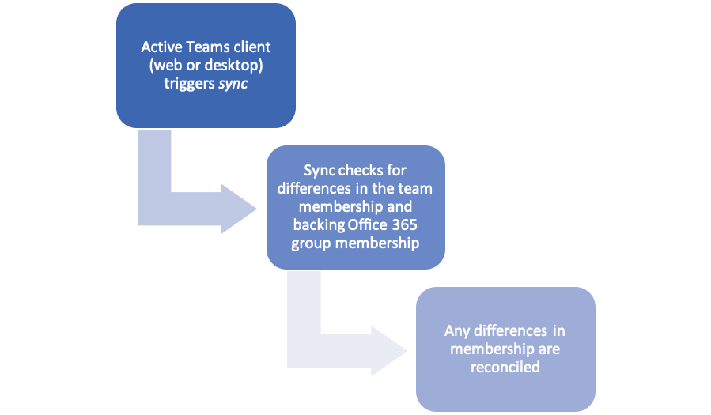

# Creating teams and managing members using Microsoft Graph

You can use the Microsoft Teams API in Microsoft Graph to create teams in multiple ways. This article describes the approach that we recommend for the best results.


## Initial team creation

All teams are backed by Office 365 groups. The quickest way to get your team up and running when you create new teams via Microsoft Graph is to set up a new Office 365 group, all all owners and members, and convert that into a team.

1. Create an [Office 365 group](https://support.office.com/article/learn-about-office-365-groups-b565caa1-5c40-40ef-9915-60fdb2d97fa2) using the [create group](/graph/api/group-post-groups?view=graph-rest-beta) operation. If you're trying to set up a class team, use the [create educationClass](/graph/api/educationroot-post-classes?view=graph-rest-beta) operation. You can specify owners and members. Make sure that you have the right owners for the newly created team, as described in Step 2.

    In order to include a team, you need to set the following property values, as shown:

    - **groupTypes** = { "Unified" } 
    - **mailEnabled** = true
    - **securityEnabled** = false

    ```http
    POST /groups
    {
        "displayName":"Flight 157",
        "mailNickname":"flight157",
        "description":"Everything about flight 157",
        "visibility":"Private",
        "groupTypes":["Unified"],
        "mailEnabled":true,
        "securityEnabled":false,
        "members@odata.bind":[
            "https://graph.microsoft.com/v1.0/users/bec05f3d-a818-4b58-8c2e-2b4e74b0246d",
            "https://graph.microsoft.com/v1.0/users/ae67a4f4-2308-4522-9021-9f402ff0fba8",
            "https://graph.microsoft.com/v1.0/users/eab978dd-35d0-4885-8c46-891b7d618783",
            "https://graph.microsoft.com/v1.0/users/6a1272b5-f6fc-45c4-95fe-fe7c5a676133"
        ],
        "owners@odata.bind":[
            "https://graph.microsoft.com/v1.0/users/6a1272b5-f6fc-45c4-95fe-fe7c5a676133",
            "https://graph.microsoft.com/v1.0/users/eab978dd-35d0-4885-8c46-891b7d618783"
        ]
    }
    ```

    The following example shows the response. 

    >**Note:** The response object shown might be shortened for readability. All the properties will be returned from an actual call.

    ```http
    HTTP/1.1 200 OK
    Content-type: application/json
    Content-length: xxx
    {
        "@odata.context":"https://graph.microsoft.com/v1.0/$metadata#groups/$entity",
        "id":"b7f968af-ca51-42f6-a77e-82c7147bc8f2"
    }
    ```

2. Ensure the team has two or more owners. You can do so via the [add owner](/graph/api/group-post-owners?view=graph-rest-beta) operation. These should be real user accounts and not service accounts. Having two owners helps handle cases where one owner leaves the company or is unavailable to perform team management operations.

3. Add all members (and guests if necessary) to the group using the [add member](/graph/api/group-post-members?view=graph-rest-beta) operation, if you did not do so in Step 1.

4. After the group is successfully created, which can take upto 15 minutes after completing Step 1, create a Microsoft Teams team using the [create team from group](/graph/api/team-put-teams?view=graph-rest-beta) operation. If you run into an error, the group creation process might not be completed; try waiting a few more minutes.

    ```http
    PUT /groups/{id}/team
    { }
    ```

    The following example shows the response. 

    >**Note:** The response object shown might be shortened for readability. All the properties will be returned from an actual call.

    ```http
    HTTP/1.1 200 OK
    Content-type: application/json
    Content-length: xxx
    {
        "@odata.context" : "https://graph.microsoft.com/v1.0/$metadata#teams/$entity",
        "id" : "b7f968af-ca51-42f6-a77e-82c7147bc8f2",
        "webUrl" : "https://example.com",
        "isArchived" : null,
        "memberSettings" : { },
        "guestSettings" : { },
        "messagingSettings" : { },
        "funSettings" : {}
    }
    ```

    The created team has the same ID as the group.

5. After this process finishes, all owners and members should be able to see the newly created team in their Teams client.

## Adding or managing members

To add members after a team is created, you use the [add member](/graph/api/group-post-members?view=graph-rest-beta) operation. Note the following with respect to membership changes:

1. Membership changes made to Office 365 groups sync to Teams via a background sync mechanism that typically takes 24 hours (or more in some cases).

2. The background process is triggered only if one or more users in the team (owner or member) is active in the Teams desktop client. Launching the Teams application and/or having it running constitutes activity — a user does not need to visit the team that is being modified specifically.

    >**Note:** The Teams mobile clients do not trigger the membership sync. At least one user should be on the desktop client to that ensure this background process goes smoothly.

## Checklist for validation

After you create a team, you can use the following checklist to verify that the team was created successfully.

### Validate team creation

1. Verify that the Office 365 group backing the team is created via the Azure AD or Microsoft 365 admin centers.

2. Verify that the team creation succeeded via the Teams admin portal.

3. Verify that the team has the correct owners and members listed via the Teams admin portal.

4. Verify that the team owners can see the team after signing into the Teams desktop or web client.

5. Verify that members can see the team after signing into the Teams desktop or web client.

### Validate addition of members

1. Verify that newly members show up in the group via the Azure AD or Microsoft 365 admin center.

2. Verify that newly added members can see the team after signing into the Teams desktop or web client.


## How Office 365 group membership changes are synchronized to Microsoft Teams

Membership changes made to an Office 365 group backing a team via the Microsoft Graph API or through the admin portal (outside of the Teams client) have to sync to the Teams service in order for newly added users to be able to see and participate in the team. Changes made directly to the group membership are synchronized to the Teams service via a background process. This background process runs in the Teams service and is triggered by user activity in Teams desktop and web clients.

For the process to get triggered, a current owner or member of that team (someone who can see the team in the Teams client) must have the Teams desktop (ideally) or web client open. Mobile clients do not trigger this sync.

The current SLA for synchronizing membership changes made to groups to Teams is up to 24 hours after the sync is triggered by client activity. It can take longer under certain circumstances (due to service load, for example).




