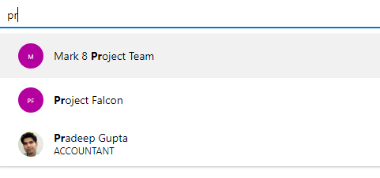

# People-Picker component

You can use the `mgt-people-picker` web component search for a specified number of people and render the list of results via Microsoft Graph. By default, the component will search for all people; you can also define a group property to further filter the results.

If the number of people to display exceeds the `show-max` value, not all people returned will be displayed in the search list.

## Example

[jsfiddle example](https://jsfiddle.net/metulev/jdv38fg0/)

```html
<mgt-people-picker></mgt-people-picker>
```



## Properties

By default, the `mgt-people-picker` component fetches events from the `/me/people` endpoint. Use the following attributes to change this behavior.

| Property | Attribute | Description                                                                                                                                                                            |
| -------- | --------- | -------------------------------------------------------------------------------------------------------------------------------------------------------------------------------------- |
| showMax  | show-max  | A number value to indicate the maximum number of people to show. the default value is 6.                                                                                             |
| people   | people    | An array of people to get or set the list of people rendered by the component. Use this property to access the people loaded by the component. Set this value to load your own people. |
| group    | group     | A string value that belongs to a Microsoft Graph defined group for further filtering of the search results.                                                                            |
| selectedPeople    | selected-people    | An array of type  `person`, representing people selected in the component. Set this value to choose selected people by default.|

The following is a `show-max` example.

```html
<mgt-people-picker show-max="4"> </mgt-people-picker>
```

## Selected People

The selected people section of the component renders each person chosen by developer or user. 


Selected People data is accessible to populate via the following methods:

***If no user is found for the provided `id`, no data will be rendered for that specific id**

1. Giving an array of `person` object to the `selected-people` property. 

      * Example
    ```html
    <mgt-people>
      <template>
        <ul>
          <li data-for="person in people">
            <mgt-people-picker selected-people="[{{ person }}]"></mgt-people-picker>
            <h3>{{ person.displayName }}</h3>
          </li>
        </ul>
      </template>
    </mgt-people>
    ```


2. Using the method `selectUsersById()` which accepts an array of Microsoft graph [user id](https://docs.microsoft.com/en-us/graph/api/resources/users?view=graph-rest-1.0) to find associated user details for selection.

      * Example
    ```javascript
    // id = Mirosoft graph User "id"
    document.querySelector('mgt-people-picker').selectUsersById(["id","id"])
    ```


## CSS custom properties

The `mgt-people-picker` component defines the following CSS custom properties.

```css
mgt-people-picker {
  --people-list-background-color: blue; /* Background-color for people under search */
  --accent-color: green; /* Color for separator of search input box and people */
}
```

## Microsoft Graph permissions

This component uses the following Microsoft Graph APIs and permissions.

| API                                                                                                              | Permission  |
| ---------------------------------------------------------------------------------------------------------------- | ----------- |
| [/me/people](https://docs.microsoft.com/en-us/graph/api/user-list-people?view=graph-rest-1.0)                    | People.Read |
| [/groups/\${groupId}/members](https://docs.microsoft.com/en-us/graph/api/group-list-members?view=graph-rest-1.0) | People.Read |

## Authentication

The control uses the global authentication provider described in the [authentication documentation](./../providers.md).
